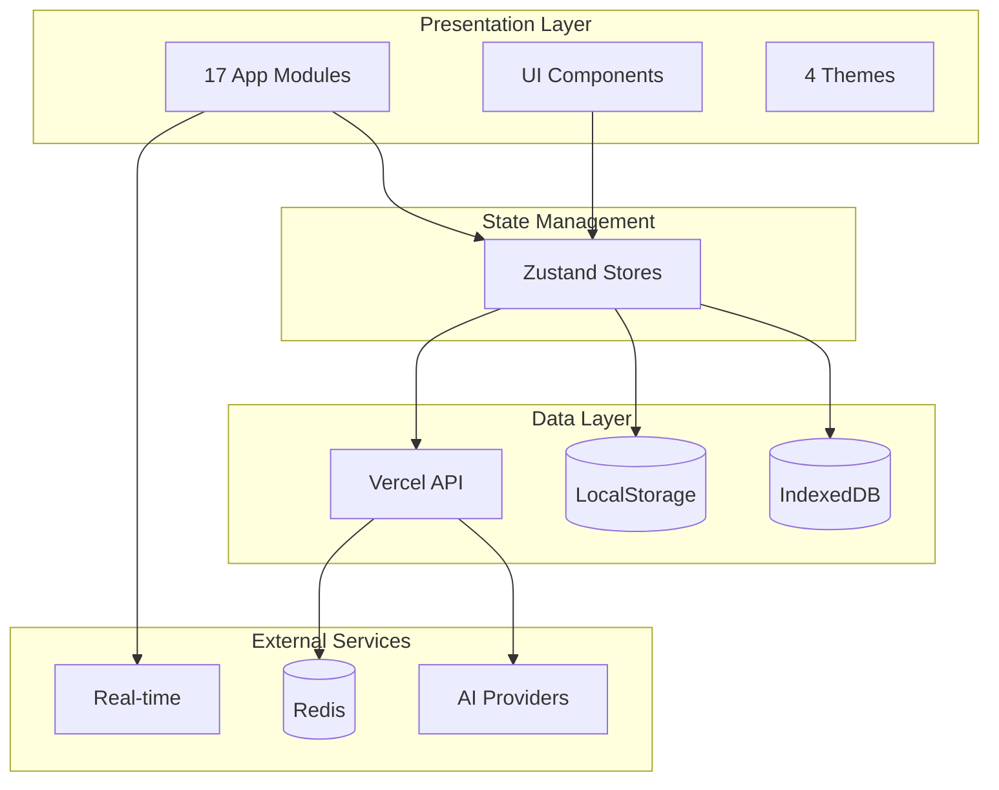

# Overview

syaOS is a web-based desktop environment that brings the nostalgia of classic operating systems to modern browsers. Experience the charm of Mac OS X Aqua, System 7, Windows XP, and Windows 98—all running in your browser with 17 fully-functional apps, an AI assistant, and a complete virtual file system.

Whether you're exploring the retro aesthetics, building HTML applets, or chatting with Ryo (the AI assistant), syaOS offers a unique blend of nostalgia and modern web technology.



## Quick Start

| I want to... | Go to |
|--------------|-------|
| Learn about the apps | [Apps Overview](/docs/apps) |
| Understand the architecture | [Architecture](/docs/architecture) |
| Understand the API layer | [API Architecture](/docs/api-architecture) |
| Build with the framework | [Application Framework](/docs/application-framework) |
| Work with AI features | [AI System](/docs/ai-system) |
| Use the APIs | [API Reference](/docs/api-reference) |

## Key Features

- **[Multi-Theme Support](/docs/theme-system):** System 7, Mac OS X (Aqua), Windows XP, Windows 98
- **[17 Built-in Apps](/docs/apps):** Finder, TextEdit, Paint, iPod, Terminal, Chats, and more
- **[AI Assistant (Ryo)](/docs/ai-system):** Chat, tool calling, app control, code generation
- **[Virtual File System](/docs/file-system):** IndexedDB-backed with lazy loading
- **[Real-time Chat](/docs/chat-rooms-api):** Pusher-powered rooms with AI integration
- **[Audio System](/docs/audio-system):** Synthesizer, soundboard, TTS, and UI sounds
- **[Component Library](/docs/component-library):** shadcn/ui + custom components with i18n

## Tech Stack

| Category | Technologies |
|----------|-------------|
| Frontend | React 19, TypeScript, Tailwind CSS v4, shadcn/ui, Framer Motion |
| State | Zustand with localStorage/IndexedDB persistence |
| Audio | Tone.js, WaveSurfer.js, Web Audio API |
| 3D | Three.js (shaders) |
| Text Editor | TipTap |
| Storage | IndexedDB, LocalStorage, Redis (Upstash) |
| AI | OpenAI, Anthropic, Google via Vercel AI SDK |
| Real-time | Pusher |
| Build | Vite, Bun |
| Desktop | Tauri (macOS, Windows, Linux) |
| Deployment | Vercel |

## Project Structure

```
├── _api/             # Vercel API endpoints (underscore prefix avoids double compilation)
├── public/           # Static assets
├── src/
│   ├── apps/         # 17 app modules
│   ├── components/   # Shared React components
│   ├── config/       # App registry
│   ├── hooks/        # 29 custom hooks
│   ├── lib/          # Libraries
│   ├── stores/       # 21 Zustand stores
│   ├── styles/       # CSS
│   ├── themes/       # 4 theme definitions
│   ├── types/        # TypeScript types
│   └── utils/        # Utility functions
├── src-tauri/        # Desktop app config
└── scripts/          # Build scripts
```
