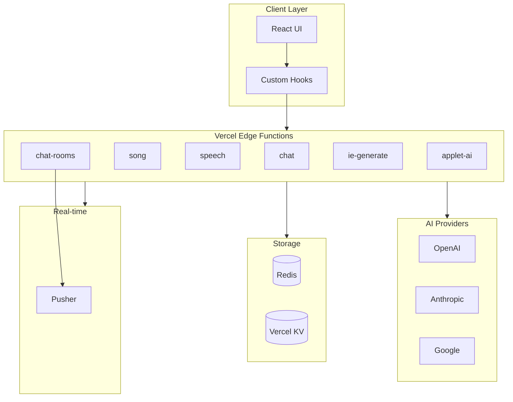
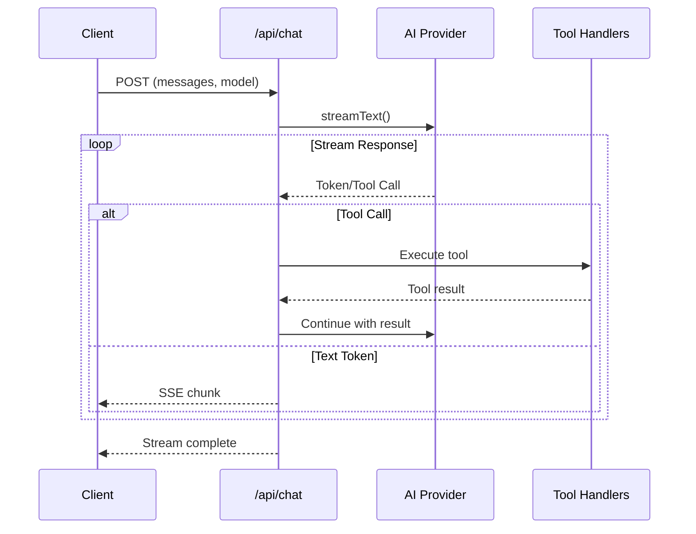
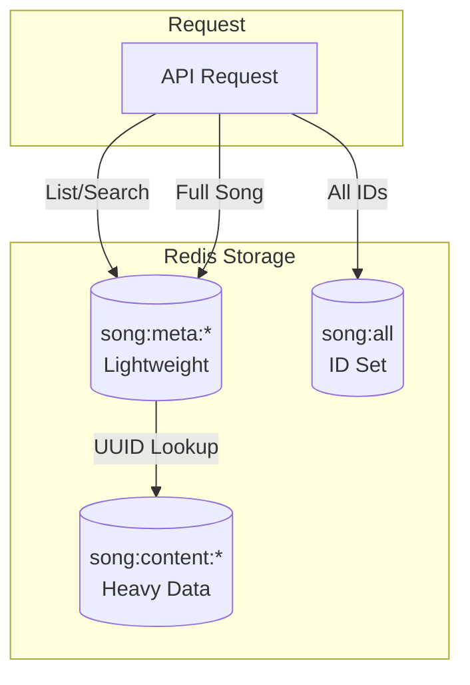

# API Architecture

syaOS uses Vercel Edge Functions for its backend API, with AI providers, Redis caching, and real-time features.

## Architecture Overview



## API Directory Structure

```
api/
├── _utils/                    # Shared utilities
│   ├── aiModels.ts           # AI provider abstraction
│   ├── aiPrompts.ts          # System prompts
│   ├── auth-validate.ts      # Token validation
│   ├── cors.ts               # CORS handling
│   ├── rate-limit.ts         # Rate limiting
│   ├── song-service.ts       # Song data service
│   └── sse.ts                # Server-Sent Events
├── chat-rooms/               # Multi-file module
│   ├── index.ts              # HTTP handlers
│   ├── _messages.ts          # Message handlers
│   ├── _presence.ts          # Presence tracking
│   ├── _pusher.ts            # Pusher integration
│   └── _redis.ts             # Redis client
├── song/                     # Multi-file module
│   ├── index.ts              # List/batch operations
│   ├── [id].ts               # Single song CRUD
│   ├── _lyrics.ts            # Lyrics parsing
│   └── _furigana.ts          # Japanese furigana
└── [endpoint].ts             # Individual endpoints
```

## API Endpoint Inventory

### Core APIs

| Endpoint | Methods | Purpose |
|----------|---------|---------|
| `/api/chat` | POST | AI chat with streaming and tool calling |
| `/api/speech` | POST | Text-to-speech synthesis |
| `/api/audio-transcribe` | POST | Speech-to-text (Whisper) |

### Media APIs

| Endpoint | Methods | Purpose |
|----------|---------|---------|
| `/api/song` | GET, POST, DELETE | Song list and batch operations |
| `/api/song/[id]` | GET, POST, DELETE | Single song CRUD + lyrics |
| `/api/youtube-search` | POST | YouTube video search |
| `/api/parse-title` | GET | YouTube title parsing |
| `/api/cover` | GET | Album art fetching |

### AI Generation APIs

| Endpoint | Methods | Purpose |
|----------|---------|---------|
| `/api/ie-generate` | POST | Internet Explorer time-travel |
| `/api/applet-ai` | POST | Applet AI assistant |

### Communication APIs

| Endpoint | Methods | Purpose |
|----------|---------|---------|
| `/api/chat-rooms` | GET, POST, DELETE | Real-time chat rooms |
| `/api/share-applet` | GET, POST, PATCH, DELETE | Applet sharing/store |

### Utility APIs

| Endpoint | Methods | Purpose |
|----------|---------|---------|
| `/api/iframe-check` | GET | Check/proxy iframe embedding |
| `/api/link-preview` | GET | OpenGraph metadata extraction |
| `/api/admin` | Various | Admin operations |

## AI Provider Abstraction

### Supported Models

| Provider | Models | Use Cases |
|----------|--------|-----------|
| **OpenAI** | gpt-5, gpt-5.1, gpt-5-mini, gpt-4o, gpt-4.1 | Default chat, code generation |
| **Anthropic** | claude-4.5, claude-4, claude-3.7, claude-3.5 | Complex reasoning |
| **Google** | gemini-2.5-pro, gemini-2.5-flash, gemini-3-pro | Image generation |

### Model Selection

```typescript
// _api/_utils/aiModels.ts
export const getModelInstance = (model: SupportedModel): LanguageModelV2 => {
  switch (model) {
    case "gpt-5":
      return openai("gpt-5");
    case "gpt-5.1":
      return openai("gpt-5.1");
    case "claude-4.5":
      return anthropic("claude-sonnet-4-5");
    case "gemini-2.5-pro":
      return google("gemini-2.5-pro");
    // ... more models
  }
};
```

## Chat API

### Streaming Architecture



### Tool Calling System

The chat API provides tools for system control:

```typescript
tools: {
  launchApp: {
    description: "Launch syaOS application",
    parameters: z.object({
      appId: z.enum(["finder", "textedit", "ipod", ...]),
      initialData: z.unknown().optional(),
    }),
  },
  
  ipodControl: {
    description: "Control iPod playback",
    parameters: z.object({
      action: z.enum(["toggle", "play", "pause", "next", "previous", ...]),
      title: z.string().optional(),
      artist: z.string().optional(),
    }),
  },
  
  generateHtml: {
    description: "Generate HTML applet",
    parameters: z.object({
      title: z.string(),
      icon: z.string(),
      code: z.string(),
    }),
  },
  
  // ... more tools
}
```

### System Prompts

```typescript
// _api/_utils/aiPrompts.ts
export const CORE_PRIORITY_INSTRUCTIONS = `
  You are Ryo, an AI assistant in syaOS...
`;

export const RYO_PERSONA_INSTRUCTIONS = `
  Ryo's personality and background...
`;

export const CODE_GENERATION_INSTRUCTIONS = `
  HTML applet generation rules...
`;

export const TOOL_USAGE_INSTRUCTIONS = `
  VFS and tool usage patterns...
`;
```

## Song API

### Split Storage Architecture



### Endpoints

| Route | Action | Description |
|-------|--------|-------------|
| `GET /api/song` | List | Songs with filters |
| `POST /api/song` | Create/Import | New songs or bulk import |
| `GET /api/song/[id]` | Read | Song with lyrics, translations |
| `POST /api/song/[id]?action=fetch-lyrics` | Fetch | Get lyrics from Kugou |
| `POST /api/song/[id]?action=translate-stream` | Translate | AI translation (SSE) |
| `POST /api/song/[id]?action=furigana-stream` | Furigana | AI furigana (SSE) |
| `DELETE /api/song/[id]` | Delete | Remove song |

## Speech APIs

### Text-to-Speech

```typescript
// api/speech.ts
const providers = {
  openai: {
    models: ["tts-1", "tts-1-hd"],
    voices: ["alloy", "echo", "fable", "onyx", "nova", "shimmer"],
  },
  elevenlabs: {
    models: ["eleven_multilingual_v2", "eleven_turbo_v2"],
    voices: ["custom voice IDs"],
  },
};

// Dual provider support
if (model === "elevenlabs") {
  return generateElevenLabsSpeech(text, voiceId, modelId);
} else {
  return generateSpeech({
    model: openai.speech("tts-1"),
    text,
    voice,
  });
}
```

### Audio Transcription

```typescript
// api/audio-transcribe.ts
const transcription = await openai.audio.transcriptions.create({
  file: audioFile,
  model: "whisper-1",
});
```

## Rate Limiting

### Counter-Based Limiting

```typescript
// _api/_utils/rate-limit.ts
export async function checkCounterLimit({
  key,
  windowSeconds,
  limit,
}: CounterLimitArgs): Promise<CounterLimitResult> {
  // Atomic increment
  const newCount = await redis.incr(key);
  
  // Set expiry on first request
  if (newCount === 1) {
    await redis.expire(key, windowSeconds);
  }
  
  const ttl = await redis.ttl(key);
  
  if (newCount > limit) {
    return { 
      allowed: false, 
      count: newCount, 
      remaining: 0,
      resetSeconds: ttl,
    };
  }
  
  return { 
    allowed: true, 
    remaining: limit - newCount,
  };
}
```

### Rate Limit Configurations

| Endpoint | Burst Limit | Daily/Budget | Window |
|----------|-------------|--------------|--------|
| Chat AI (auth) | 25 | per 5 hours | Sliding |
| Chat AI (anon) | 3 | per 5 hours | Sliding |
| Speech TTS | 10/min | 50/day | Fixed |
| IE Generate | 3/min | 10/5hr | Fixed |
| Applet AI (auth) | 50 | per hour | Fixed |
| Applet AI (anon) | 15 | per hour | Fixed |
| Transcribe | 10/min | 50/day | Fixed |

## Authentication

### Token Validation

```typescript
// _api/_utils/auth-validate.ts
export async function validateAuthToken(
  redis: RedisLike,
  username: string,
  authToken: string,
  options: { allowExpired?: boolean; refreshOnGrace?: boolean } = {}
): Promise<AuthValidationResult> {
  // 1. Check active token
  const userKey = getUserTokenKey(username, authToken);
  const exists = await redis.exists(userKey);
  
  if (exists) {
    // Refresh TTL on use
    await redis.expire(userKey, USER_TTL_SECONDS);
    return { valid: true, expired: false };
  }
  
  // 2. Check grace period for expired tokens
  if (options.allowExpired) {
    const lastTokenKey = getLastTokenKey(username);
    const lastTokenData = await redis.get(lastTokenKey);
    // ... grace period logic
  }
  
  return { valid: false };
}
```

### Auth Headers

| Header | Value | Purpose |
|--------|-------|---------|
| `Authorization` | `Bearer <token>` | Authentication token |
| `X-Username` | Username | User identification |

### Token Configuration

| Setting | Value |
|---------|-------|
| Token TTL | 90 days |
| Grace period | 30 days |
| Admin bypass | User "ryo" |

## CORS Handling

```typescript
// _api/_utils/cors.ts
export function isAllowedOrigin(origin: string | null): boolean {
  if (!origin) return false;
  
  // Always allow Tailscale origins
  if (isTailscaleOrigin(origin)) return true;
  
  const env = getRuntimeEnv();
  
  if (env === "production") {
    return origin === PROD_ALLOWED_ORIGIN;
  }
  
  if (env === "preview") {
    return isVercelPreviewOrigin(origin);
  }
  
  // Development
  return isLocalhostOrigin(origin);
}
```

## Response Patterns

### JSON Response Helper

```typescript
const jsonResponse = (data: unknown, status = 200, headers = {}) =>
  new Response(JSON.stringify(data), {
    status,
    headers: {
      "Content-Type": "application/json",
      "Access-Control-Allow-Origin": effectiveOrigin,
      ...headers,
    },
  });
```

### Error Response Pattern

```typescript
const errorResponse = (message: string, status = 400) => {
  logInfo(requestId, `Response: ${status} - ${message}`);
  return jsonResponse({ error: message }, status);
};
```

### SSE Streaming Response

```typescript
const stream = new ReadableStream({
  async start(controller) {
    for await (const chunk of aiStream) {
      controller.enqueue(`data: ${JSON.stringify(chunk)}\n\n`);
    }
    controller.enqueue("data: [DONE]\n\n");
    controller.close();
  },
});

return new Response(stream, {
  headers: {
    "Content-Type": "text/event-stream",
    "Cache-Control": "no-cache",
    "Connection": "keep-alive",
  },
});
```

## Edge Runtime Configuration

All APIs use Vercel Edge Runtime for low latency:

```typescript
export const config = { runtime: "edge" };
export const runtime = "edge";
export const maxDuration = 60; // or 80 for AI endpoints
```

## Redis Key Patterns

| Prefix | Purpose | Example |
|--------|---------|---------|
| `rl:ai:` | AI rate limiting | `rl:ai:chat:user123` |
| `song:meta:` | Song metadata | `song:meta:abc123` |
| `song:content:` | Song content | `song:content:abc123` |
| `ie:cache:` | IE generation cache | `ie:cache:hash` |
| `applet:share:` | Shared applets | `applet:share:xyz` |
| `chat:token:user:` | Auth tokens | `chat:token:user:alice:tok` |
| `chat:room:` | Chat room data | `chat:room:general` |

## Related Documentation

- [Chat API](/docs/chat-api) - Detailed chat API documentation
- [Song API](/docs/song-api) - Song API reference
- [AI Generation APIs](/docs/ai-generation-apis) - IE and Applet AI
