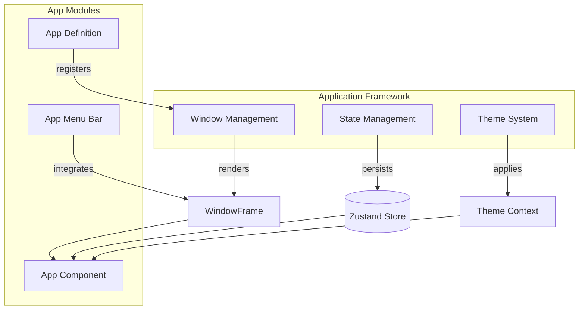
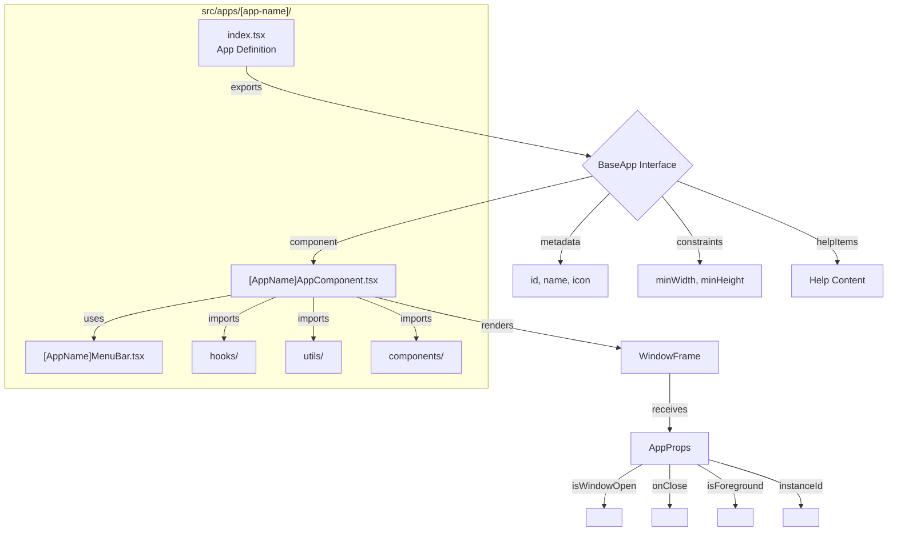

# Application Framework

The syaOS application framework provides a unified system for building and managing desktop-style applications within the browser. It handles window rendering, state management, theming, and app lifecycle, allowing developers to focus on application logic rather than window management infrastructure.

## Overview

The syaOS application framework is built around three core pillars: **Window Management**, **State Management**, and **Theme System**. Together, these systems enable apps to have native desktop-like behavior including multiple windows, window positioning, resizing, minimizing, and theming that adapts to different operating system aesthetics.

Apps in syaOS are organized as self-contained modules in `src/apps/[app-name]/`, each exporting a standardized app definition that includes the app component, metadata, and configuration. The framework handles window lifecycle, state persistence, and theme-aware rendering automatically, while apps focus on their specific functionality.

The framework supports multiple window instances per app (multi-window), allowing users to open several windows of the same application simultaneously. Window state, including position and size, is persisted across sessions. Apps can also define custom window constraints, menu bars, and help content that integrates seamlessly with the system.

## Key Components

| Component | Purpose |
|-----------|---------|
| Window Management | Handles window rendering, positioning, resizing, minimizing, maximizing, and multi-instance support through the `WindowFrame` component and `useWindowManager` hook |
| State Management | Manages app state, window instances, foreground ordering, and persistence using Zustand stores with localStorage integration |
| Theme System | Provides OS-themed appearance (Mac OS X, System 7, Windows XP, Windows 98) with theme-aware components, colors, fonts, and layout metadata |

## App Structure

Apps follow a standardized structure and naming convention. Each app is defined in `src/apps/[app-name]/` with the following typical organization:

- **Main Component**: `[AppName]AppComponent.tsx` - The primary app component that receives `AppProps` and renders the app content wrapped in `WindowFrame`
- **Menu Bar**: `[AppName]MenuBar.tsx` - App-specific menu bar component (rendered outside `WindowFrame` for macOS themes, inside for Windows themes)
- **App Definition**: `index.tsx` or `index.ts` - Exports the app definition object conforming to `BaseApp` interface, including component, metadata, help items, and window constraints
- **Optional Folders**: `hooks/`, `utils/`, `types/`, `components/` - App-specific logic, utilities, types, and sub-components

Apps receive common props via the `AppProps` interface, including `isWindowOpen`, `onClose`, `isForeground`, `instanceId`, and `initialData`. The `WindowFrame` component handles all window chrome, controls, and interactions, while apps focus on their content and functionality.

## Subsections

- [Window Management](/docs/window-management) - Window rendering, positioning, and frame components
- [State Management](/docs/state-management) - Zustand stores and data persistence
- [Theme System](/docs/theme-system) - Themes, appearance, and visual customization
- [Hooks Architecture](/docs/hooks-architecture) - Custom React hooks for audio, media, and utilities
- [Component Architecture](/docs/component-architecture) - UI component organization and patterns
