# Window Management

syaOS implements a sophisticated multi-instance window manager with theme-aware chrome, animations, and desktop-like behaviors.

## Architecture Overview


## Core Components

### WindowFrame Component

The `WindowFrame` component (`src/components/layout/WindowFrame.tsx`) renders window chrome, handles user interactions, and provides animations.

#### Props Interface

```typescript
interface WindowFrameProps {
  children: React.ReactNode;
  title: string;
  onClose?: () => void;
  isForeground?: boolean;
  appId: AppId;
  isShaking?: boolean;
  /** Window material: "default" (opaque), "transparent", "notitlebar" (immersive) */
  material?: "default" | "transparent" | "notitlebar";
  skipInitialSound?: boolean;
  windowConstraints?: {
    minWidth?: number;
    minHeight?: number;
    maxWidth?: number | string;
    maxHeight?: number | string;
  };
  instanceId?: string;
  onNavigateNext?: () => void;
  onNavigatePrevious?: () => void;
  interceptClose?: boolean;
  menuBar?: React.ReactNode;
  keepMountedWhenMinimized?: boolean;
}
```

#### Material Modes

| Mode | Description | Use Case |
|------|-------------|----------|
| `default` | Standard opaque window background | Most apps |
| `transparent` | Semi-transparent background | iPod, Photo Booth |
| `notitlebar` | Immersive mode with floating titlebar on hover | Videos, games |

### useWindowManager Hook

The `useWindowManager` hook (`src/hooks/useWindowManager.ts`) manages window positioning, dragging, and resizing.

```typescript
interface UseWindowManagerProps {
  appId: AppId;
  instanceId?: string;
}

// Returns
interface UseWindowManagerReturn {
  windowPosition: { x: number; y: number };
  windowSize: { width: number; height: number };
  isDragging: boolean;
  resizeType: ResizeType;
  handleMouseDown: (e: MouseEvent) => void;
  handleResizeStart: (e: MouseEvent, type: ResizeType) => void;
  setWindowSize: (size: WindowSize) => void;
  setWindowPosition: (pos: WindowPosition) => void;
  maximizeWindowHeight: (maxConstraint?: number) => void;
  getSafeAreaBottomInset: () => number;
  snapZone: "left" | "right" | null;
  computeInsets: () => WindowInsets;
}
```

## Window Instance State

Each window instance maintains comprehensive state:

```typescript
interface AppInstance {
  instanceId: string;        // Unique identifier (e.g., "finder-1")
  appId: AppId;              // App type identifier
  isOpen: boolean;           // Visibility state
  isForeground: boolean;     // Focus state
  isMinimized?: boolean;     // Dock/taskbar minimize state
  isLoading?: boolean;       // For lazy-loaded apps
  position?: { x: number; y: number };
  size?: { width: number; height: number };
  title?: string;            // Static title set at creation
  displayTitle?: string;     // Dynamic title (updated by WindowFrame)
  createdAt: number;         // For stable ordering in taskbar
  initialData?: unknown;     // App-specific data passed at launch
}
```

## Window Lifecycle

### State Transitions


### Creation Flow


### Cascade Positioning

New windows are automatically positioned with an offset to prevent exact overlap:

```typescript
const computeDefaultWindowState = () => {
  const appIndex = appIds.indexOf(appId);
  const offsetIndex = appIndex >= 0 ? appIndex : 0;

  return {
    position: {
      x: isMobile ? 0 : 16 + offsetIndex * 32,
      y: isMobile ? 28 : 40 + offsetIndex * 20,
    },
    size: isMobile ? getMobileWindowSize(appId) : config.defaultSize,
  };
};
```

## Z-Index Management

Z-index is calculated from position in the `instanceOrder` array. The last item in the array is the topmost window.

```mermaid
graph TB
    subgraph instanceOrder["instanceOrder Array"]
        direction TB
        A["[0] finder-1"] --> B["[1] textedit-2"]
        B --> C["[2] ipod-3"]
        C --> D["[3] chats-4 ← foreground"]
    end
    
    subgraph zIndex["Z-Index Stack (visual)"]
        direction TB
        Z4["z:103 chats-4 (top)"]
        Z3["z:102 ipod-3"]
        Z2["z:101 textedit-2"]
        Z1["z:100 finder-1 (bottom)"]
    end
    
    instanceOrder -.->|"z = BASE + index"| zIndex
```



### Bringing to Front

```typescript
bringInstanceToForeground: (instanceId) => {
  set((state) => {
    const instances = { ...state.instances };
    let order = [...state.instanceOrder];
    
    // Update foreground flags
    Object.keys(instances).forEach((id) => {
      instances[id] = {
        ...instances[id],
        isForeground: id === instanceId,
      };
    });
    
    // Move to end of order array (top of stack)
    order = [...order.filter((id) => id !== instanceId), instanceId];
    
    return { instances, instanceOrder: order, foregroundInstanceId: instanceId };
  });
}
```

## Window Constraints

Apps define window constraints in the app registry:

```typescript
interface WindowConstraints {
  minSize?: { width: number; height: number };
  maxSize?: { width: number; height: number };
  defaultSize: { width: number; height: number };
  mobileDefaultSize?: { width: number; height: number };
  mobileSquare?: boolean;  // If true, height = width on mobile
}
```

| Property | Description |
|----------|-------------|
| `minSize` | Minimum window dimensions during resize |
| `maxSize` | Maximum window dimensions |
| `defaultSize` | Initial size on desktop |
| `mobileDefaultSize` | Initial size on mobile devices |
| `mobileSquare` | Force square aspect ratio on mobile |

## Resize Behavior

### Resize Handles

WindowFrame renders 8 resize handles (N, S, E, W, NE, NW, SE, SW) as invisible hit areas:

```typescript
// Handle positions expand during active resize for smoother tracking
const handleClass = cn(
  "absolute cursor-n-resize pointer-events-auto",
  resizeType?.includes("n")
    ? "top-[-100px] h-[200px]"  // Expanded during resize
    : "top-1 h-2"               // Normal state
);
```

### Double-Click Behaviors

| Target | Action |
|--------|--------|
| Top/bottom resize handle | Maximize height only |
| Title bar | Toggle full maximize |
| Side resize handle | No special action |

## Snap-to-Edge

Windows can snap to screen edges during drag:

```typescript
// Detect snap zones - trigger when cursor within 20px of edge
const SNAP_THRESHOLD = 20;

if (clientX <= SNAP_THRESHOLD) {
  setSnapZone("left");
} else if (clientX >= window.innerWidth - SNAP_THRESHOLD) {
  setSnapZone("right");
} else {
  setSnapZone(null);
}
```

On drag end:
- Window snaps to half-screen width
- Pre-snap state saved for restore
- Visual indicator shown during drag

## Theme-Specific Chrome

WindowFrame renders different title bars based on the active theme:

### macOS (Aqua) Theme
- Traffic light buttons (close/minimize/zoom) on LEFT
- Centered title text
- Pinstripe background texture
- Rounded corners

### macOS (System 7) Theme
- Close box only on LEFT
- Left-aligned title
- Dotted pattern background

### Windows (XP/98) Theme
- Title bar with icon
- Minimize/maximize/close buttons on RIGHT
- Gradient title bar background
- System font styling


## Animations

WindowFrame uses Framer Motion for all animations:

### Open Animation
```typescript
initial={{ scale: 0.95, opacity: 0 }}
animate={{ scale: 1, opacity: 1 }}
transition={{ duration: 0.15 }}
```

### Close Animation
```typescript
exit={{ scale: 0.95, opacity: 0 }}
transition={{ duration: 0.15 }}
```

### Minimize Animation
```typescript
// Animate toward dock icon position
exit={{
  scale: 0.1,
  opacity: 0,
  x: dockIconPosition.x - windowCenter.x,
  y: dockIconPosition.y - windowCenter.y,
}}
```

### Shake/Nudge Animation
```typescript
// Horizontal shake for alerts
animate={{
  x: [0, -4, 4, -4, 4, -2, 2, 0],
}}
transition={{ duration: 0.4 }}
```

## Sound & Haptic Feedback

Every window operation has corresponding feedback:

| Operation | Sound | Haptic |
|-----------|-------|--------|
| Open | `WINDOW_OPEN` | Light |
| Close | `WINDOW_CLOSE` | Light |
| Maximize | `WINDOW_EXPAND` | Medium |
| Restore | `WINDOW_COLLAPSE` | Medium |
| Minimize | `WINDOW_ZOOM_MINIMIZE` | Light |
| Start drag | `WINDOW_MOVE_MOVING` | None |
| End drag | `WINDOW_MOVE_STOP` | Light |
| Start resize | `WINDOW_RESIZE_RESIZING` | None |
| End resize | `WINDOW_RESIZE_STOP` | Light |

## Multi-Instance Apps

Only specific apps support multiple windows:

```typescript
const supportsMultiWindow =
  multiWindow ||
  appId === "textedit" ||
  appId === "finder" ||
  appId === "applet-viewer";
```

When launching a multi-instance app:
- If no instance exists: Create new instance
- If instance exists but minimized: Restore existing
- If instance exists and visible: Create new instance (if supported)

## Expose Mode (Mission Control)

Windows can enter Expose mode for an overview:

```typescript
const exposeTransform = useMemo(() => {
  if (!exposeMode) return null;
  
  const openInstances = Object.values(instances)
    .filter(inst => inst.isOpen && !inst.isMinimized);
  
  const grid = calculateExposeGrid(openInstances.length);
  return getExposeTransform(grid, myIndex, windowPosition, windowSize);
}, [exposeMode, instances, windowPosition, windowSize]);
```

## Close Interception

Apps can intercept close to show confirmation dialogs:

```typescript
// In app component
useEffect(() => {
  if (!interceptClose) return;

  const handlePerformClose = () => performClose();
  
  window.addEventListener(
    `closeWindow-${instanceId}`,
    handlePerformClose
  );

  return () => {
    window.removeEventListener(`closeWindow-${instanceId}`, handlePerformClose);
  };
}, [instanceId, performClose, interceptClose]);
```

Apps set `interceptClose={true}` on WindowFrame and listen for the close event to show unsaved changes dialogs.

## Mobile Adaptations

| Adaptation | Description |
|------------|-------------|
| Full-width windows | Windows stretch to screen width on mobile |
| Touch-sized handles | Larger resize handle hit areas |
| Swipe navigation | Horizontal swipe between apps (phone only) |
| Mobile default sizes | Per-app optimized dimensions |
| Simplified controls | Reduced window chrome on small screens |

## Related Documentation

- [Application Framework](/docs/application-framework) - App structure overview
- [State Management](/docs/state-management) - Window state persistence
- [Theme System](/docs/theme-system) - Theme-specific window styling
