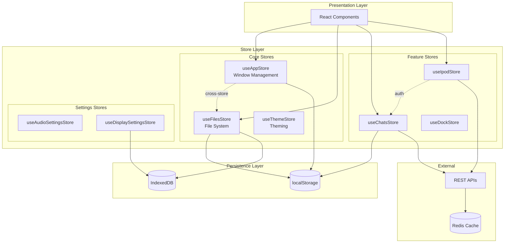
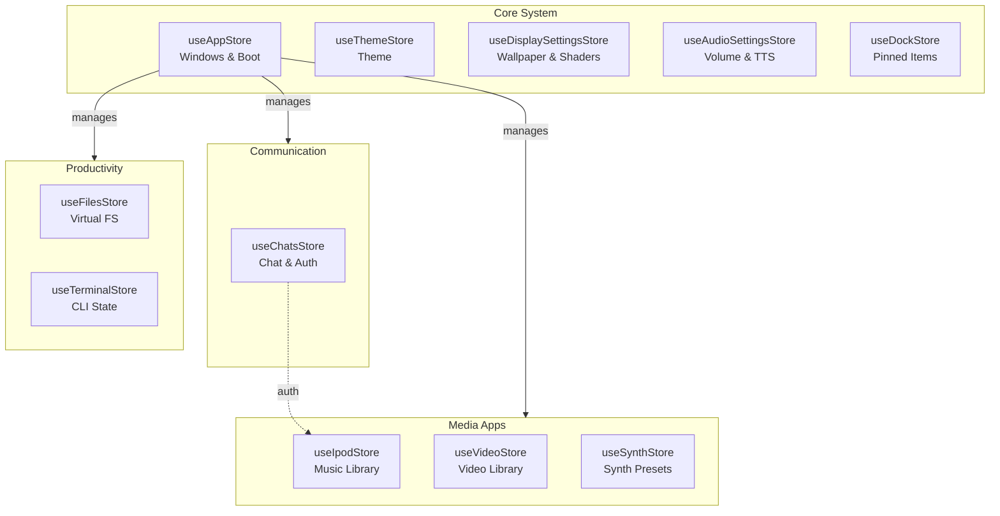
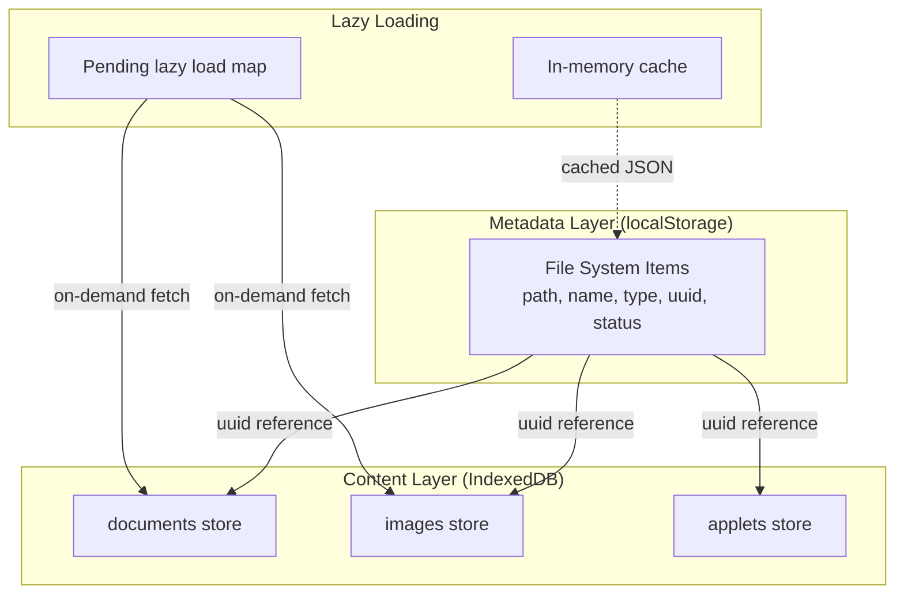
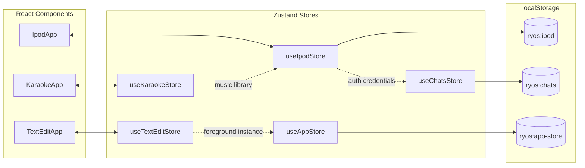
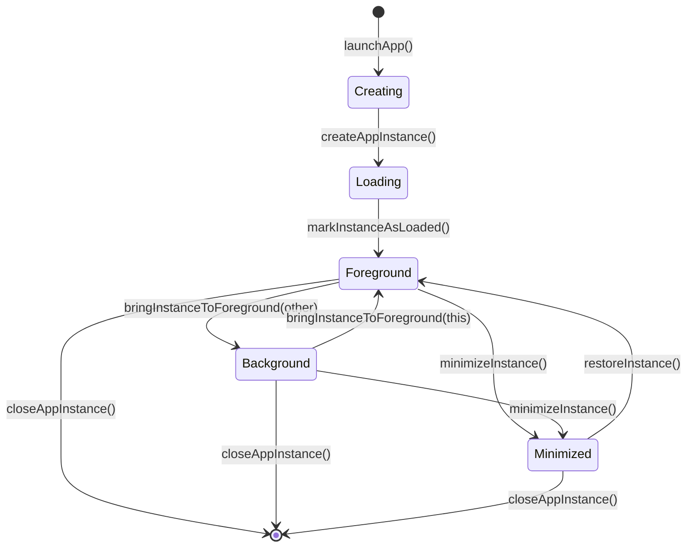
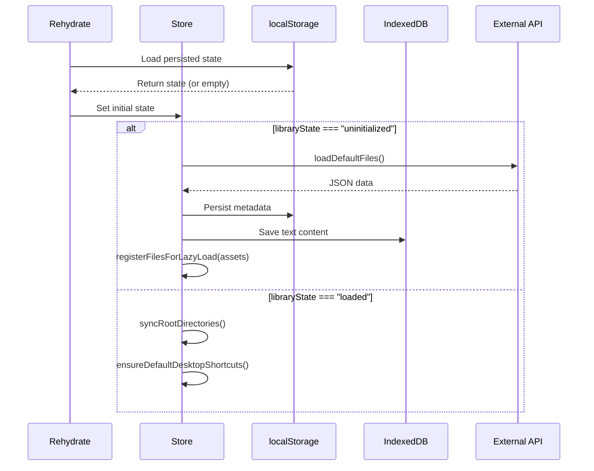

# State Management

syaOS uses Zustand for state management with 21+ stores following consistent patterns, combined with localStorage and IndexedDB for persistence.

## Architecture Overview



## Store Inventory

### Core System Stores

| Store | Persistence Key | Purpose |
|-------|-----------------|---------|
| `useAppStore` | `ryos:app-store` | Window/instance management, boot state, AI model selection |
| `useFilesStore` | `ryos:files` | Virtual filesystem metadata |
| `useThemeStore` | `os_theme` (manual) | OS theme selection |
| `useDisplaySettingsStore` | `ryos:display-settings` | Wallpaper, shaders, screen saver |
| `useDockStore` | `dock-storage` | Dock pinned items, scale, visibility |
| `useAudioSettingsStore` | `ryos:audio-settings` | Volume controls, audio feature toggles |
| `useLanguageStore` | `ryos:language` | UI language preference |

### App-Specific Stores

| Store | Persistence Key | Purpose |
|-------|-----------------|---------|
| `useChatsStore` | `ryos:chats` | Chat rooms, messages, authentication |
| `useIpodStore` | `ryos:ipod` | Music library, playback state, lyrics |
| `useVideoStore` | `ryos:videos` | Video library, playback |
| `useKaraokeStore` | `ryos:karaoke` | Karaoke session state |
| `useTerminalStore` | `ryos:terminal` | Command history, vim state |
| `useSynthStore` | `ryos:synth` | Synthesizer presets |
| `useSoundboardStore` | `ryos:soundboard` | Soundboard slots and recordings |
| `useAppletStore` | `applet-storage` | Applet window dimensions |
| `useFinderStore` | `ryos:finder` | Finder instances, view preferences |
| `useTextEditStore` | `ryos:textedit` | Recent documents |
| `useInternetExplorerStore` | `ryos:ie` | Favorites, history |
| `usePaintStore` | `ryos:paint` | Tool settings |
| `usePhotoBoothStore` | `ryos:photobooth` | Recent photos |
| `usePcStore` | `ryos:pc` | Virtual PC state |

### Store Architecture Diagram



## Store Pattern

All stores follow a consistent Zustand pattern with persist middleware:

```typescript
import { create } from "zustand";
import { persist, createJSONStorage } from "zustand/middleware";

interface ExampleState {
  // State
  someValue: string;
  items: Item[];
  
  // Actions
  setSomeValue: (v: string) => void;
  addItem: (item: Item) => void;
  removeItem: (id: string) => void;
  
  // Computed (via get())
  getItemById: (id: string) => Item | undefined;
}

export const useExampleStore = create<ExampleState>()(
  persist(
    (set, get) => ({
      // Initial state
      someValue: "default",
      items: [],
      
      // Actions
      setSomeValue: (v) => set({ someValue: v }),
      
      addItem: (item) => set((state) => ({
        items: [...state.items, item],
      })),
      
      removeItem: (id) => set((state) => ({
        items: state.items.filter((item) => item.id !== id),
      })),
      
      // Computed getter
      getItemById: (id) => get().items.find((item) => item.id === id),
    }),
    {
      name: "ryos:example",           // localStorage key
      version: 1,                      // Migration version
      storage: createJSONStorage(() => localStorage),
      
      // Selective persistence
      partialize: (state) => ({
        someValue: state.someValue,
        items: state.items,
      }),
      
      // Version migrations
      migrate: (persisted, version) => {
        if (version < 1) {
          // Handle migration
        }
        return persisted;
      },
      
      // Post-rehydration hook
      onRehydrateStorage: () => (state, error) => {
        if (state) {
          // Initialize or sync after rehydration
        }
      },
    }
  )
);
```

## Persistence Strategies

### localStorage Persistence (via Zustand `persist`)

Used for settings, preferences, and lightweight metadata:

```typescript
persist(
  (set) => ({ /* state and actions */ }),
  {
    name: "ryos:audio-settings",
    version: STORE_VERSION,
    partialize: (state) => ({
      masterVolume: state.masterVolume,
      uiVolume: state.uiVolume,
      // Only persist necessary fields
    }),
  }
)
```

### IndexedDB Integration

Used for large binary data (images, documents, applets):

```typescript
// IndexedDB stores
const STORES = {
  DOCUMENTS: "documents",      // Text files
  IMAGES: "images",           // Binary images
  APPLETS: "applets",         // HTML applet content
  TRASH: "trash",             // Deleted file content
  CUSTOM_WALLPAPERS: "custom_wallpapers",
};

// Database: syaOS (version 7)
interface StoredContent {
  name: string;               // Original filename
  content: string | Blob;     // File content
}
```

### Hybrid Persistence (Files Store)

The `useFilesStore` demonstrates a sophisticated two-layer architecture:



### Manual localStorage (Theme Store)

Some stores use manual persistence for more control:

```typescript
setTheme: (theme) => {
  set({ current: theme });
  localStorage.setItem("os_theme", theme);  // Manual save
  document.documentElement.dataset.osTheme = theme;
  ensureLegacyCss(theme);
},

hydrate: () => {
  const saved = localStorage.getItem("os_theme");
  const theme = saved || "macosx";
  set({ current: theme });
  document.documentElement.dataset.osTheme = theme;
},
```

## Migration System

### Version-Based Migrations

```typescript
migrate: (persistedState: unknown, version: number) => {
  const state = persistedState as StoreState;
  
  if (version < 5) {
    // Add status field and UUIDs
    for (const path in state.items) {
      state.items[path] = {
        ...state.items[path],
        status: state.items[path].status || "active",
        uuid: !state.items[path].isDirectory 
          ? state.items[path].uuid || uuidv4() 
          : undefined,
      };
    }
  }
  
  if (version < 6) {
    // Add timestamp fields
    const now = Date.now();
    for (const path in state.items) {
      state.items[path].createdAt = state.items[path].createdAt || now;
      state.items[path].modifiedAt = state.items[path].modifiedAt || now;
    }
  }
  
  return state;
},
```

### Recovery Mechanisms

Critical data uses separate recovery keys to survive store resets:

```typescript
const USERNAME_RECOVERY_KEY = "_usr_recovery_key_";
const AUTH_TOKEN_RECOVERY_KEY = "_auth_recovery_key_";

// Encode/decode for basic obfuscation
const encode = (value: string) => btoa(value.split("").reverse().join(""));
const decode = (encoded: string) => atob(encoded).split("").reverse().join("");

// Recovery on rehydrate
onRehydrateStorage: () => (state, error) => {
  if (state?.username === null) {
    const recovered = getUsernameFromRecovery();
    if (recovered) state.username = recovered;
  }
}
```

## Cross-Store Communication

### Direct Store Access

Stores can access other stores via `getState()`:

```typescript
// In useIpodStore - accessing ChatsStore for auth
async function saveLyricOffsetToServer(trackId: string, offset: number) {
  const { username, authToken } = useChatsStore.getState();
  
  if (!username || !authToken) {
    console.log("Skipping save - user not logged in");
    return false;
  }
  
  // Make authenticated API call
  await fetch("/api/song/...", {
    headers: {
      "Authorization": `Bearer ${authToken}`,
      "X-Username": username,
    },
  });
}
```

### Store Dependency Pattern

```typescript
// In useAppStore - accessing AppletStore for window sizing
createAppInstance: (appId, initialData, title) => {
  if (appId === "applet-viewer") {
    const path = (initialData as { path?: string })?.path;
    if (path) {
      const saved = useAppletStore.getState().getAppletWindowSize(path);
      if (saved) size = saved;
    }
  }
}
```

### Event-Based Communication

```typescript
// Window state changes broadcast via CustomEvents
window.dispatchEvent(
  new CustomEvent("appStateChange", {
    detail: { appId, isOpen: true, isForeground: true },
  })
);

window.dispatchEvent(
  new CustomEvent("instanceStateChange", {
    detail: { instanceId, isOpen: true, isForeground: true },
  })
);

window.dispatchEvent(
  new CustomEvent("wallpaperChange", { detail: wallpaperPath })
);
```

### Cross-Store Dependencies Map



## State Flow Patterns

### App Instance Lifecycle



### Library Initialization Flow



## Best Practices

### Selective Persistence (`partialize`)

```typescript
partialize: (state) => ({
  // Only persist necessary state, exclude:
  // - Transient UI state (isLoading, etc.)
  // - Large computed data
  // - Runtime-only values
  tracks: state.tracks,
  currentSongId: state.currentSongId,
  // NOT: isPlaying, currentLyrics, currentFuriganaMap
}),
```

### Optimized Selectors (`useShallow`)

```typescript
import { useShallow } from "zustand/react/shallow";

// Prevents unnecessary re-renders when selecting multiple values
function useAppStoreShallow<T>(
  selector: (state: AppStoreState) => T
): T {
  return useAppStore(useShallow(selector));
}

// Usage
const { instances, foregroundInstanceId } = useAppStoreShallow((s) => ({
  instances: s.instances,
  foregroundInstanceId: s.foregroundInstanceId,
}));
```

### Debounced Server Sync

```typescript
const lyricOffsetSaveTimers = new Map<string, NodeJS.Timeout>();

function debouncedSaveLyricOffset(trackId: string, offset: number): void {
  const existing = lyricOffsetSaveTimers.get(trackId);
  if (existing) clearTimeout(existing);

  const timer = setTimeout(() => {
    lyricOffsetSaveTimers.delete(trackId);
    saveLyricOffsetToServer(trackId, offset);
  }, 2000); // 2 second debounce

  lyricOffsetSaveTimers.set(trackId, timer);
}
```

### Data Caching with Deduplication

```typescript
let cachedFileSystemData: FileSystemData | null = null;
let fileSystemDataPromise: Promise<FileSystemData> | null = null;

async function loadDefaultFiles(): Promise<FileSystemData> {
  if (cachedFileSystemData) return cachedFileSystemData;
  if (fileSystemDataPromise) return fileSystemDataPromise;  // Dedup in-flight
  
  fileSystemDataPromise = (async () => {
    const data = await fetch("/data/filesystem.json").then(r => r.json());
    cachedFileSystemData = data;
    return data;
  })();
  
  return fileSystemDataPromise;
}
```

### Immutable Updates

```typescript
// Array updates without mutation
set((state) => ({
  tracks: state.tracks.map((track, i) =>
    i === trackIndex ? { ...track, lyricOffset: newOffset } : track
  ),
}));

// Object updates without mutation
set((state) => ({
  instances: {
    ...state.instances,
    [instanceId]: { ...state.instances[instanceId], isForeground: true },
  },
}));
```

## Related Documentation

- [Window Management](/docs/window-management) - Window state in useAppStore
- [File System](/docs/file-system) - useFilesStore details
- [Audio System](/docs/audio-system) - useAudioSettingsStore details
