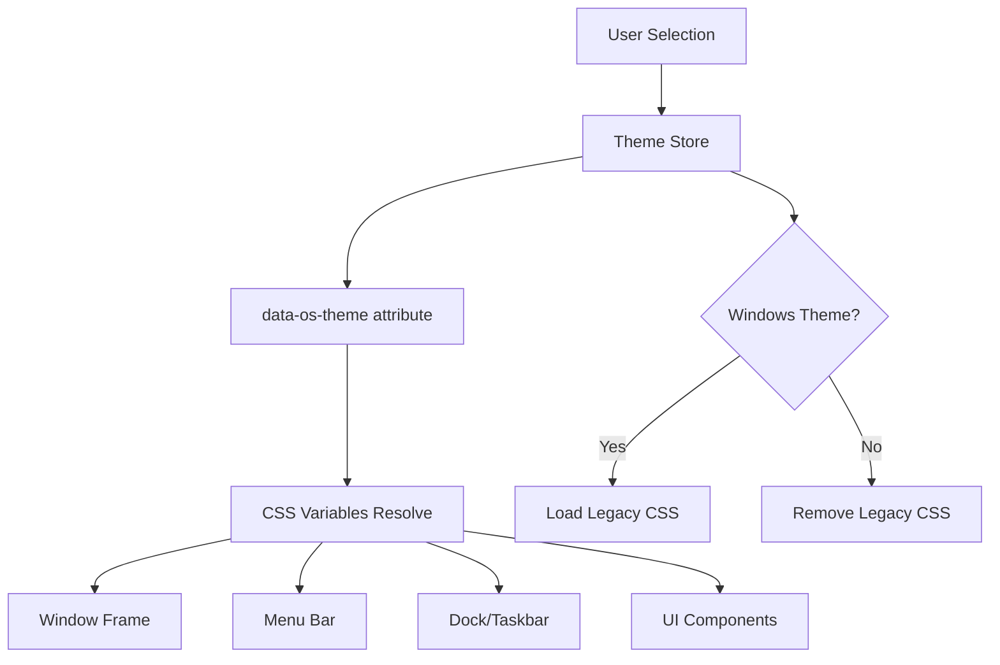
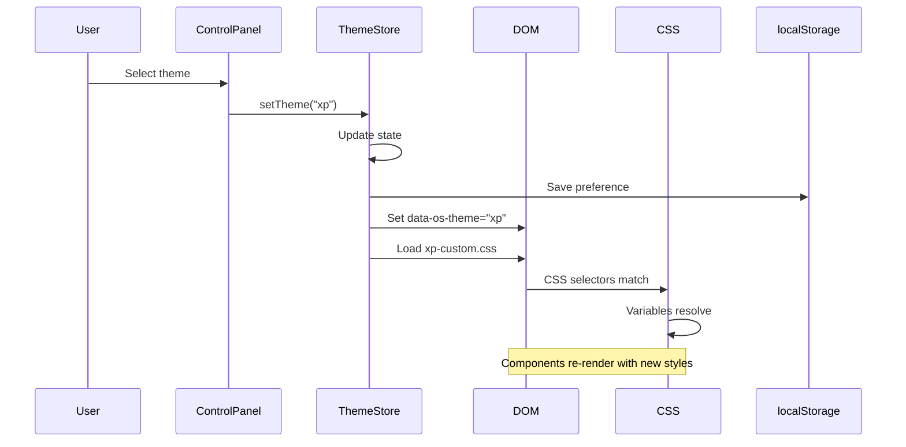
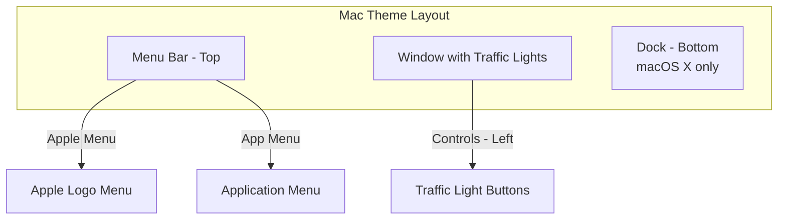
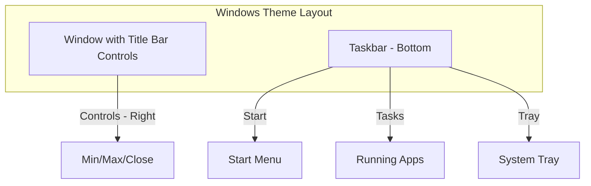

# Theme System

syaOS supports 4 themes emulating classic operating systems with comprehensive CSS variable systems and platform-specific UI behaviors.

## Available Themes

| Theme ID | Name | Platform | Era | Key Elements |
|----------|------|----------|-----|--------------|
| `macosx` | Aqua | Mac OS X | ~2001 | Glossy buttons, traffic lights, pinstripe, dock |
| `system7` | System 7 | Classic Mac | ~1991 | Black & white, dotted titlebar pattern |
| `xp` | Luna | Windows XP | ~2001 | Blue chrome, rounded corners, taskbar |
| `win98` | Classic | Windows 98 | ~1998 | 3D beveled face, blue gradient titlebar |

## Theme Architecture



## Theme Metadata

Each theme provides metadata for layout decisions:

```typescript
interface ThemeMetadata {
  /** Whether this is a Windows-style theme (XP, 98) */
  isWindows: boolean;
  /** Whether this is a macOS-style theme (macOS X, System 7) */
  isMac: boolean;
  /** Whether the theme has a dock (bottom app launcher) */
  hasDock: boolean;
  /** Whether the theme has a taskbar (Windows-style bottom bar) */
  hasTaskbar: boolean;
  /** Whether the theme has a top menu bar */
  hasMenuBar: boolean;
  /** Title bar controls position: "left" (macOS) or "right" (Windows) */
  titleBarControlsPosition: "left" | "right";
  /** Default menu bar height in pixels */
  menuBarHeight: number;
  /** Taskbar height in pixels (0 if no taskbar) */
  taskbarHeight: number;
  /** Base dock height before scaling (0 if no dock) */
  baseDockHeight: number;
}
```

### Platform Comparison

| Property | System 7 | macOS X | Windows XP | Windows 98 |
|----------|----------|---------|------------|------------|
| `isWindows` | `false` | `false` | `true` | `true` |
| `isMac` | `true` | `true` | `false` | `false` |
| `hasDock` | `false` | `true` | `false` | `false` |
| `hasTaskbar` | `false` | `false` | `true` | `true` |
| `hasMenuBar` | `true` | `true` | `false` | `false` |
| `titleBarControlsPosition` | `"left"` | `"left"` | `"right"` | `"right"` |
| `menuBarHeight` | `30px` | `25px` | `0px` | `0px` |
| `taskbarHeight` | `0px` | `0px` | `30px` | `30px` |
| `baseDockHeight` | `0px` | `56px` | `0px` | `0px` |

## Theme Definition Interface

```typescript
interface OsTheme {
  id: OsThemeId;
  name: string;
  metadata: ThemeMetadata;
  
  fonts: {
    ui: string;
    mono?: string;
  };
  
  colors: {
    windowBg: string;
    menubarBg: string;
    menubarBorder: string;
    windowBorder: string;
    windowBorderInactive?: string;
    
    titleBar: {
      activeBg: string;
      inactiveBg: string;
      text: string;
      inactiveText: string;
      border?: string;
      borderInactive?: string;
      pattern?: string;
    };
    
    button: {
      face: string;
      highlight: string;
      shadow: string;
      activeFace?: string;
    };
    
    trafficLights?: {
      close: string;
      minimize: string;
      maximize: string;
    };
    
    selection: {
      bg: string;
      text: string;
    };
    
    text: {
      primary: string;
      secondary: string;
      disabled: string;
    };
  };
  
  metrics: {
    borderWidth: string;
    radius: string;
    titleBarHeight: string;
    windowShadow: string;
  };
  
  wallpaperDefaults?: {
    photo?: string;
    tile?: string;
  };
}
```

## CSS Variable System

Themes are applied via the `data-os-theme` attribute on the document root:

```css
:root[data-os-theme="macosx"] {
  /* Typography */
  --os-font-ui: "LucidaGrande", "Lucida Grande", ...;
  --os-font-mono: Monaco, Menlo, monospace;
  
  /* Window */
  --os-color-window-bg: #ececec;
  --os-color-window-border: rgba(0, 0, 0, 0.4);
  --os-window-shadow: 0 3px 10px rgba(0,0,0,0.3);
  
  /* Menu Bar */
  --os-color-menubar-bg: linear-gradient(to bottom, #f8f8f8, #d4d4d4);
  --os-color-menubar-border: rgba(0, 0, 0, 0.44);
  --os-color-menubar-text: #000000;
  
  /* Title Bar */
  --os-color-titlebar-active-bg: linear-gradient(to bottom, #e8e8e8, #d0d0d0);
  --os-color-titlebar-inactive-bg: #f6f6f6;
  --os-color-titlebar-text: #000000;
  
  /* Selection */
  --os-color-selection-bg: rgba(39, 101, 202, 0.88);
  --os-color-selection-text: #ffffff;
  
  /* Metrics */
  --os-metrics-border-width: 1px;
  --os-metrics-radius: 0.45rem;
  --os-metrics-titlebar-height: 22px;
  --os-metrics-menubar-height: 25px;
  
  /* Textures */
  --os-pinstripe-window: repeating-linear-gradient(...);
  --os-pinstripe-titlebar: linear-gradient(...);
}
```

### Variable Categories

| Category | Variables | Description |
|----------|-----------|-------------|
| Typography | `--os-font-ui`, `--os-font-mono` | UI and monospace fonts |
| Window | `--os-color-window-bg`, `--os-window-shadow` | Window appearance |
| Menu Bar | `--os-color-menubar-bg`, `--os-color-menubar-text` | Menu bar styling |
| Title Bar | `--os-color-titlebar-*` | Window title bar |
| Selection | `--os-color-selection-bg`, `--os-color-selection-text` | Selected items |
| Text | `--os-color-text-primary`, `--os-color-text-secondary` | Text colors |
| Metrics | `--os-metrics-radius`, `--os-metrics-border-width` | Dimensions |
| Textures | `--os-pinstripe-*`, `--os-texture-*` | Background patterns |

## Theme State Management

```typescript
// src/stores/useThemeStore.ts
export const useThemeStore = create<ThemeState>((set) => ({
  current: "macosx",
  
  setTheme: (theme) => {
    set({ current: theme });
    localStorage.setItem("os_theme", theme);
    document.documentElement.dataset.osTheme = theme;
    ensureLegacyCss(theme);
  },
  
  hydrate: () => {
    const saved = localStorage.getItem("os_theme") as OsThemeId | null;
    const theme = saved || "macosx";
    set({ current: theme });
    document.documentElement.dataset.osTheme = theme;
    ensureLegacyCss(theme);
  },
}));
```

### Legacy CSS Loading

Windows themes dynamically load additional CSS:

```typescript
async function ensureLegacyCss(theme: OsThemeId) {
  // Only XP and Win98 use legacy CSS
  if (theme !== "xp" && theme !== "win98") {
    if (legacyCssLink) {
      legacyCssLink.remove();
      legacyCssLink = null;
    }
    return;
  }

  const href = theme === "xp" 
    ? "/css/xp-custom.css" 
    : "/css/98-custom.css";

  const link = document.createElement("link");
  link.rel = "stylesheet";
  link.href = href;
  
  if (legacyCssLink) {
    legacyCssLink.replaceWith(link);
  } else {
    document.head.appendChild(link);
  }
  legacyCssLink = link;
}
```

## Theme Switching Flow



## Platform-Specific UI

### macOS Themes (System 7 & macOS X)



**Characteristics:**
- Top menu bar with Apple logo
- Traffic light buttons (close/minimize/zoom) on LEFT
- Dock (macOS X only)
- Aqua button styling with gradients
- Pinstripe textures

### Windows Themes (XP & 98)



**Characteristics:**
- Bottom taskbar with Start button
- Title bar buttons on RIGHT
- Legacy CSS from xp.css/98.css
- 3D border effects

## Theme-Aware Component Pattern

Components use the theme store to adapt their rendering:

```typescript
import { useThemeStore } from "@/stores/useThemeStore";

function MyComponent() {
  const currentTheme = useThemeStore((state) => state.current);
  const isXpTheme = currentTheme === "xp" || currentTheme === "win98";
  const isMacTheme = currentTheme === "macosx";

  if (isMacTheme) {
    return <AquaButton>Click me</AquaButton>;
  }
  
  if (isXpTheme) {
    return <button className="button">Click me</button>;
  }
  
  return <ClassicButton>Click me</ClassicButton>;
}
```

### Theme Helper Functions

```typescript
// Check theme platform
export function isWindowsTheme(theme: OsThemeId): boolean {
  return theme === "xp" || theme === "win98";
}

export function isMacTheme(theme: OsThemeId): boolean {
  return theme === "macosx" || theme === "system7";
}

// Get theme metadata
export function getThemeMetadata(theme: OsThemeId): ThemeMetadata {
  return themes[theme].metadata;
}
```

## Theme-Aware Icon System

Icons are resolved based on the current theme:

```typescript
// src/utils/icons.ts
export function pickIconPath(
  name: string,
  { theme, fallbackTheme = "default" }: GetIconPathOptions = {}
): string {
  // No theme: use fallback
  if (!theme) {
    return `/icons/${fallbackTheme}/${name}`;
  }
  
  // Check if theme has this icon
  if (manifest.themes[theme]?.includes(name)) {
    return `/icons/${theme}/${name}`;
  }
  
  // Fallback to default
  return `/icons/${fallbackTheme}/${name}`;
}
```

**Directory Structure:**
```
public/icons/
├── default/          # Fallback icons
├── macosx/           # macOS X specific
├── system7/          # System 7 specific
├── xp/               # Windows XP specific
└── win98/            # Windows 98 specific
```

## Aqua Styling (macOS X)

### Aqua Buttons

```css
.aqua-button {
  height: 28px;
  padding: 0 16px;
  border-radius: 14px;
  background: linear-gradient(
    to bottom,
    #fff 0%,
    #f0f0f0 50%,
    #e0e0e0 50%,
    #f5f5f5 100%
  );
  box-shadow: 
    inset 0 1px 0 rgba(255,255,255,0.8),
    0 1px 2px rgba(0,0,0,0.2);
}

.aqua-button.primary {
  background: linear-gradient(
    to bottom,
    #6cb3fa 0%,
    #1f7cf5 50%,
    #1066e5 50%,
    #58b0fa 100%
  );
  color: white;
}

/* Top shine effect */
.aqua-button:before {
  content: "";
  position: absolute;
  top: 2px;
  left: 10%;
  right: 10%;
  height: 40%;
  background: linear-gradient(
    to bottom,
    rgba(255,255,255,0.8),
    rgba(255,255,255,0)
  );
  border-radius: 50%;
}
```

### Traffic Light Buttons

```css
.traffic-light {
  width: 13px;
  height: 13px;
  border-radius: 50%;
  border: 1px solid rgba(0,0,0,0.2);
}

.traffic-light.close {
  background: linear-gradient(#ff6059, #e33e32);
}

.traffic-light.minimize {
  background: linear-gradient(#ffbd2e, #e5a000);
}

.traffic-light.maximize {
  background: linear-gradient(#29c941, #19a82e);
}
```

### Pinstripe Textures

```css
--os-pinstripe-window: repeating-linear-gradient(
  0deg,
  transparent 0px,
  transparent 1.5px,
  rgba(255, 255, 255, 0.85) 1.5px,
  rgba(255, 255, 255, 0.85) 4px
),
linear-gradient(to bottom, #ececec 0%, #ececec 100%);
```

## Inactive Window Handling

Each theme handles inactive windows differently:

```css
/* System 7 - Gray selection */
:root[data-os-theme="system7"] .window:not(.is-foreground) {
  --os-color-selection-bg: #cfcfcf;
  --os-color-selection-text: #000000;
}

/* macOS X - Lighter border */
:root[data-os-theme="macosx"] .window:not(.is-foreground) {
  --os-color-window-border: rgba(0, 0, 0, 0.08);
  --os-color-titlebar-border: rgba(0, 0, 0, 0.2);
}

/* Windows - Standard inactive styling */
:root[data-os-theme="xp"] .window:not(.is-foreground) .title-bar {
  background: linear-gradient(#8ca8ce, #a0b8da);
}
```

## Wallpaper Defaults

Each theme has default wallpaper suggestions:

| Theme | Photo Default | Tile Default |
|-------|---------------|--------------|
| macOS X | Aqua Blue | - |
| System 7 | - | Desktop Pattern |
| XP | Bliss | - |
| Win98 | - | Teal |

## Related Documentation

- [Application Framework](/docs/application-framework) - Theme integration in apps
- [Window Management](/docs/window-management) - Theme-specific window chrome
- [UI Components](/docs/ui-components) - Theme-aware components
