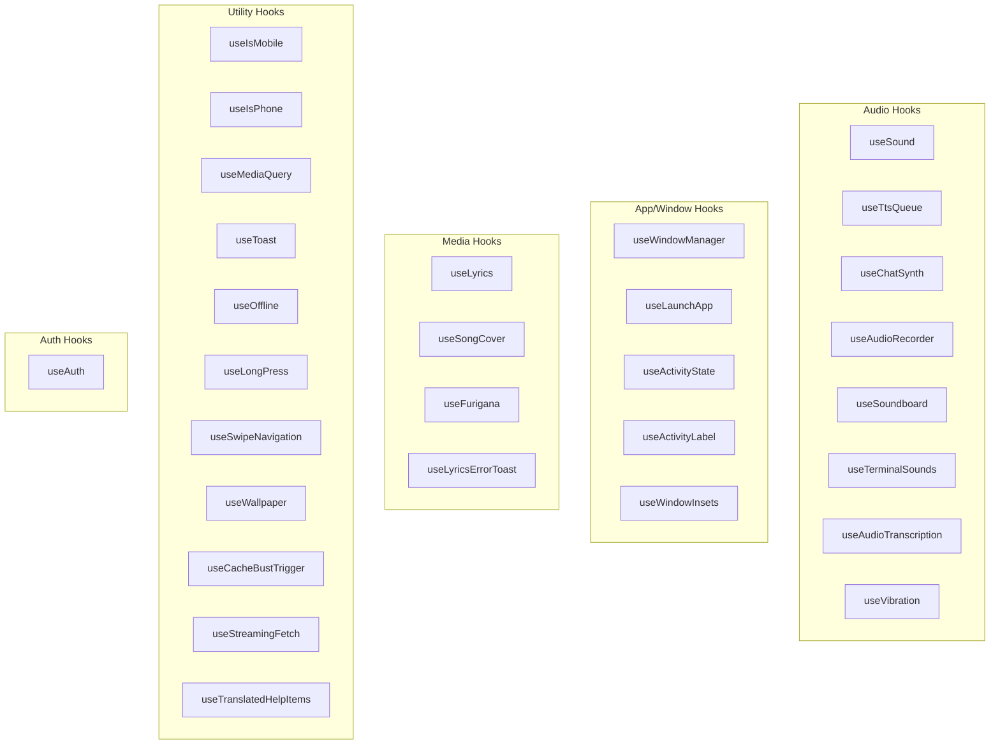
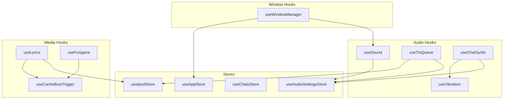

# Hooks Architecture

syaOS provides 29 custom hooks organized by functionality, enabling audio playback, window management, media handling, and more.

## Hook Categories Overview



## Audio Hooks

### useSound

Web Audio API-based playback for UI sounds with caching and volume control.

```typescript
interface UseSoundReturn {
  play: (options?: { volume?: number; fadeIn?: boolean }) => Promise<void>;
  stop: () => void;
  isPlaying: boolean;
}

// Usage
const { play: playClick } = useSound(Sounds.BUTTON_CLICK);
playClick({ volume: 0.8 });
```

**Features:**
- AudioBuffer caching with LRU eviction
- Load deduplication (prevents duplicate fetches)
- Concurrent source limiting (16 mobile, 32 desktop)
- Volume ramping to prevent clicks
- Context change detection (re-caches when AudioContext recreated)

**Available Sound Categories:**
| Category | Sounds |
|----------|--------|
| Window | `WINDOW_OPEN`, `WINDOW_CLOSE`, `WINDOW_EXPAND`, `WINDOW_COLLAPSE` |
| Interaction | `BUTTON_CLICK`, `MENU_OPEN`, `MENU_CLOSE` |
| Alerts | `ALERT_SOSUMI`, `ALERT_BONK`, `ALERT_INDIGO` |
| App-specific | `PHOTO_SHUTTER`, `VIDEO_TAPE`, `IPOD_CLICK_WHEEL` |

### useTtsQueue

Gap-free text-to-speech with intelligent queuing and volume ducking.

```typescript
interface UseTtsQueueReturn {
  speak: (text: string, options?: TtsOptions) => Promise<void>;
  stop: () => void;
  isSpeaking: boolean;
  queue: TtsQueueItem[];
}

// Usage
const { speak, stop, isSpeaking } = useTtsQueue();
await speak("Hello, world!", { provider: "openai", voice: "nova" });
```

**Features:**
- AudioContext timeline scheduling for gap-free playback
- Parallel fetching (up to 3 concurrent TTS requests)
- Volume ducking: iPod reduced to 35%, chat synth to 60% during speech
- Micro-fades (10ms) to prevent audio clicks

### useChatSynth

Musical feedback for typing using Tone.js synthesis.

```typescript
interface UseChatSynthReturn {
  playNote: () => void;
  setPreset: (preset: SynthPreset) => void;
  currentPreset: SynthPreset;
}

// Usage
const { playNote, setPreset } = useChatSynth();
setPreset("ethereal");
```

**Presets:**
| Preset | Oscillator | Character |
|--------|------------|-----------|
| Classic | Triangle | Warm, balanced |
| Ethereal | Sine | Soft, dreamy |
| Digital | Square | Sharp, electronic |
| Retro | Sawtooth | Vintage, buzzy |
| Off | - | Disabled |

**Features:**
- Pentatonic scale (C4, D4, F4, G4, A4, C5, D5)
- Effects chain: Filter → Tremolo → Reverb → PolySynth
- 16 voice polyphony limit
- Global instance persists across HMR

### useAudioRecorder

Microphone recording with format detection.

```typescript
interface UseAudioRecorderReturn {
  startRecording: () => Promise<void>;
  stopRecording: () => Promise<string>; // Returns base64
  isRecording: boolean;
  error: string | null;
}

// Usage
const { startRecording, stopRecording, isRecording } = useAudioRecorder();
await startRecording();
const base64Audio = await stopRecording();
```

**Features:**
- MediaRecorder API with 200ms chunk intervals
- Format detection: WebM (Chrome/Firefox), MP4 (Safari)
- Base64 encoding for storage
- Proper stream cleanup

### useAudioTranscription

Voice-to-text with silence detection.

```typescript
interface UseAudioTranscriptionReturn {
  startListening: () => Promise<void>;
  stopListening: () => Promise<void>;
  transcript: string;
  isListening: boolean;
  silenceLevel: number;
}

// Usage
const { startListening, transcript, isListening } = useAudioTranscription({
  onTranscript: (text) => console.log(text),
  silenceThreshold: 0.01,
  silenceDuration: 2000,
});
```

**Features:**
- Adaptive silence detection
- Auto-stop on silence
- Volume level monitoring
- Whisper API integration

## App/Window Hooks

### useWindowManager

Window positioning, dragging, resizing, and snap-to-edge.

```typescript
interface UseWindowManagerReturn {
  windowPosition: { x: number; y: number };
  windowSize: { width: number; height: number };
  isDragging: boolean;
  resizeType: ResizeType;
  handleMouseDown: (e: MouseEvent) => void;
  handleResizeStart: (e: MouseEvent, type: ResizeType) => void;
  setWindowSize: (size: WindowSize) => void;
  setWindowPosition: (pos: WindowPosition) => void;
  maximizeWindowHeight: () => void;
  snapZone: "left" | "right" | null;
  computeInsets: () => WindowInsets;
}

// Usage
const { windowPosition, handleMouseDown, snapZone } = useWindowManager({
  appId: "finder",
  instanceId: "finder-1",
});
```

**Features:**
- Cascade positioning for new windows
- Snap-to-edge (50% screen width)
- Mobile-aware constraints
- Sound integration for drag/resize

### useLaunchApp

App launching with instance management.

```typescript
interface UseLaunchAppReturn {
  launchApp: (appId: AppId, initialData?: unknown) => string;
  launchOrFocusApp: (appId: AppId) => void;
  closeApp: (instanceId: string) => void;
}

// Usage
const { launchApp, launchOrFocusApp } = useLaunchApp();
const instanceId = launchApp("textedit", { filePath: "/Documents/note.md" });
```

**Features:**
- Multi-instance support for eligible apps
- Restore minimized instances
- Initial data passing
- Instance ID generation

### useWindowInsets

Theme-aware safe area calculation.

```typescript
interface WindowInsets {
  top: number;      // Menu bar height
  bottom: number;   // Dock/taskbar height
  left: number;
  right: number;
}

// Usage
const insets = useWindowInsets();
const availableHeight = window.innerHeight - insets.top - insets.bottom;
```

## Media Hooks

### useLyrics

Lyrics fetching with translation support.

```typescript
interface UseLyricsReturn {
  lyrics: LyricLine[];
  isLoading: boolean;
  error: string | null;
  hasLyrics: boolean;
  translation: LyricTranslation | null;
  refetch: () => void;
}

// Usage
const { lyrics, isLoading, translation } = useLyrics({
  songId: "abc123",
  title: "Song Title",
  artist: "Artist Name",
  enableTranslation: true,
});
```

**Features:**
- Multiple lyrics sources (Kugou, etc.)
- AI translation with streaming
- Furigana/soramimi prefetch
- Cache bust trigger support

### useFurigana

Japanese text annotation (furigana and soramimi).

```typescript
interface UseFuriganaReturn {
  furiganaMap: Map<string, FuriganaSegment[]>;
  soramimiMap: Map<string, SoramimiSegment[]>;
  furiganaProgress: number;
  soramimiProgress: number;
  isLoadingFurigana: boolean;
  isLoadingSoramimi: boolean;
}

// Usage
const { furiganaMap, soramimiMap, furiganaProgress } = useFurigana({
  songId: "abc123",
  lines: lyricsLines,
  enabled: true,
});
```

**Features:**
- Progressive SSE streaming
- Ordered loading (furigana before soramimi for Japanese)
- Real-time progress updates

### useSongCover

Album art fetching with caching.

```typescript
interface UseSongCoverReturn {
  coverUrl: string | null;
  isLoading: boolean;
  error: string | null;
}

// Usage
const { coverUrl, isLoading } = useSongCover({
  title: "Song Title",
  artist: "Artist Name",
  fallbackUrl: "/default-cover.png",
});
```

**Features:**
- In-memory cache
- YouTube thumbnail fallback
- Error handling with fallback

## Utility Hooks

### useIsMobile / useIsPhone

Device detection hooks.

```typescript
// useIsMobile: Touch OR small screen
const isMobile = useIsMobile(); // Default breakpoint: 768px

// useIsPhone: Touch AND small screen  
const isPhone = useIsPhone();   // Default breakpoint: 640px
```

### useOffline

Network status detection with polling.

```typescript
interface UseOfflineReturn {
  isOffline: boolean;
  lastOnline: Date | null;
}

// Usage
const { isOffline } = useOffline();
if (isOffline) {
  showOfflineIndicator();
}
```

**Features:**
- `navigator.onLine` monitoring
- Periodic polling (5s intervals)
- Last online timestamp

### useLongPress

Touch long-press detection.

```typescript
interface UseLongPressReturn {
  onTouchStart: (e: TouchEvent) => void;
  onTouchEnd: () => void;
  onTouchMove: () => void;
}

// Usage
const longPressHandlers = useLongPress({
  onLongPress: () => showContextMenu(),
  delay: 500, // ms
});

<div {...longPressHandlers} />
```

### useSwipeNavigation

Horizontal swipe gesture detection.

```typescript
interface UseSwipeNavigationReturn {
  handlers: {
    onTouchStart: (e: TouchEvent) => void;
    onTouchMove: (e: TouchEvent) => void;
    onTouchEnd: () => void;
  };
  isSwiping: boolean;
  swipeDirection: "left" | "right" | null;
}

// Usage
const { handlers, swipeDirection } = useSwipeNavigation({
  onSwipeLeft: () => nextApp(),
  onSwipeRight: () => prevApp(),
  threshold: 50,
});
```

### useStreamingFetch

Generic SSE streaming with lifecycle management.

```typescript
interface UseStreamingFetchReturn<T> {
  data: T | null;
  isLoading: boolean;
  error: string | null;
  progress: number;
}

// Usage
const { data, progress, isLoading } = useStreamingFetch<TranslationResult>({
  url: "/api/translate",
  body: { text, targetLang },
  onProgress: (p) => setProgress(p),
  onComplete: (result) => handleResult(result),
});
```

**Features:**
- Abort controller integration
- Stale request prevention
- Offline detection
- Progress tracking

### useCacheBustTrigger

Force refresh detection for shared state.

```typescript
interface UseCacheBustTriggerReturn {
  currentTrigger: number;
  isForceRequest: boolean;
  markHandled: () => void;
}

// Usage
const { isForceRequest, markHandled } = useCacheBustTrigger();

useEffect(() => {
  if (isForceRequest) {
    refetchData();
    markHandled();
  }
}, [isForceRequest]);
```

## Auth Hook

### useAuth

Complete authentication flow management.

```typescript
interface UseAuthReturn {
  username: string | null;
  isAuthenticated: boolean;
  isLoading: boolean;
  login: (username: string, password: string) => Promise<boolean>;
  logout: () => Promise<void>;
  verifyToken: () => Promise<boolean>;
  showPasswordDialog: boolean;
  setShowPasswordDialog: (show: boolean) => void;
}

// Usage
const { username, isAuthenticated, login, logout } = useAuth();

if (!isAuthenticated) {
  await login("alice", "password123");
}
```

## Common Patterns

### Global AudioContext Management

Audio hooks share a global context:

```typescript
import { getAudioContext, resumeAudioContext } from "@/lib/audioContext";

// Always resume before playback
await resumeAudioContext();
const ctx = getAudioContext();
```

### Store Integration

Hooks use fine-grained Zustand selectors:

```typescript
const speechVolume = useAudioSettingsStore((s) => s.speechVolume);
const masterVolume = useAudioSettingsStore((s) => s.masterVolume);
```

### Stale Request Prevention

```typescript
const currentIdRef = useRef(id);

useEffect(() => {
  currentIdRef.current = id;
  const controller = new AbortController();
  
  fetchData(id, controller.signal).then((data) => {
    // Check if still current
    if (id !== currentIdRef.current) return;
    setData(data);
  });
  
  return () => controller.abort();
}, [id]);
```

### Volume Ramping

```typescript
const targetVolume = volume * uiVolume * masterVolume;
const now = audioContext.currentTime;

gainNode.gain.setValueAtTime(gainNode.gain.value, now);
gainNode.gain.linearRampToValueAtTime(targetVolume, now + 0.01);
```

## Hook Dependencies



## Usage Recommendations

| Hook | Use When | Notes |
|------|----------|-------|
| `useSound` | UI feedback | Use `Sounds` enum for paths |
| `useTtsQueue` | Long-form speech | Auto-queues for seamless playback |
| `useChatSynth` | Typing feedback | Configurable presets |
| `useWindowManager` | Any draggable window | Handles snap-to-edge |
| `useLaunchApp` | Opening apps | Handles multi-instance |
| `useLyrics` | Synced lyrics | Includes translation support |
| `useFurigana` | Japanese text | Wait for furigana before soramimi |
| `useIsMobile` | Touch/small screen | Use for layout decisions |
| `useIsPhone` | Phones specifically | More restrictive than isMobile |
| `useOffline` | Network-dependent features | Includes periodic polling |

## Related Documentation

- [Audio System](/docs/audio-system) - Audio architecture details
- [Window Management](/docs/window-management) - Window hook integration
- [State Management](/docs/state-management) - Store patterns
