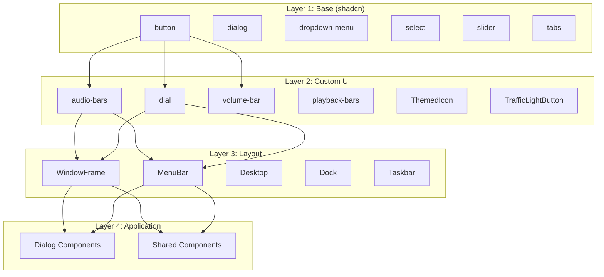
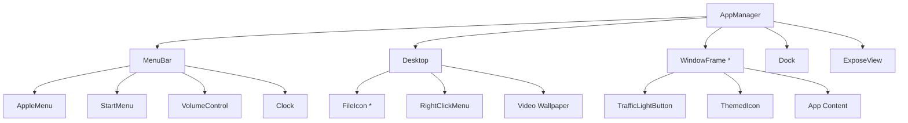
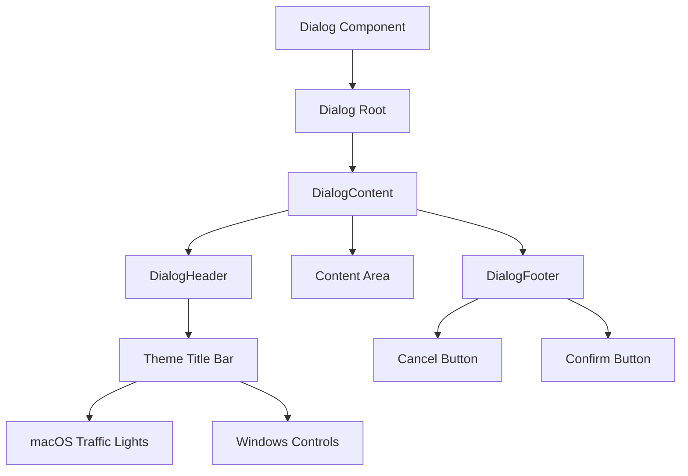
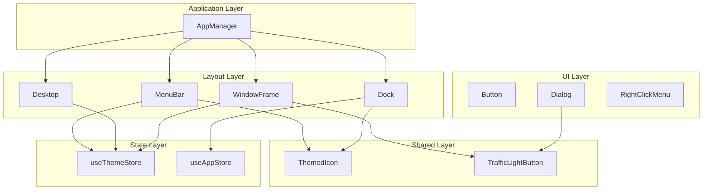

# Component Architecture

syaOS uses a layered component architecture with theme-aware rendering, organized into layout, UI, dialog, and shared component categories.

## Architecture Overview



## Component Directory Structure

```
src/components/
├── layout/           # Desktop environment structure
│   ├── Desktop.tsx
│   ├── Dock.tsx
│   ├── MenuBar.tsx
│   ├── WindowFrame.tsx
│   ├── AppleMenu.tsx
│   ├── StartMenu.tsx
│   ├── ExposeView.tsx
│   └── AppManager.tsx
├── ui/               # Base UI components
│   ├── button.tsx
│   ├── dialog.tsx
│   ├── dropdown-menu.tsx
│   ├── select.tsx
│   ├── slider.tsx
│   ├── switch.tsx
│   ├── tabs.tsx
│   ├── audio-bars.tsx
│   ├── dial.tsx
│   ├── volume-bar.tsx
│   └── ...
├── dialogs/          # Modal dialogs
│   ├── AboutDialog.tsx
│   ├── ConfirmDialog.tsx
│   ├── HelpDialog.tsx
│   └── ...
└── shared/           # Cross-app utilities
    ├── ThemedIcon.tsx
    ├── TrafficLightButton.tsx
    ├── EmojiAquarium.tsx
    └── ...
```

## Layout Components

### Desktop (`Desktop.tsx`)

The root desktop surface handling wallpaper, icons, and drag-drop.

```typescript
interface DesktopProps {
  apps: AnyApp[];
  appStates: AppManagerState;
  toggleApp: (appId: AppId, initialData?: unknown) => void;
  onClick?: () => void;
  desktopStyles?: DesktopStyles;
}
```

**Features:**
- Theme-conditional icon layout (XP: left-aligned, macOS: right-aligned)
- Video wallpaper support with visibility handling
- Desktop shortcut management via `useFilesStore`
- Drag-and-drop alias creation
- Long-press context menu for mobile

### WindowFrame (`WindowFrame.tsx`)

Window chrome with theme-specific rendering.

```typescript
interface WindowFrameProps {
  children: React.ReactNode;
  title: string;
  appId: AppId;
  material?: "default" | "transparent" | "notitlebar";
  windowConstraints?: WindowConstraints;
  instanceId?: string;
  menuBar?: React.ReactNode;
  keepMountedWhenMinimized?: boolean;
}
```

**Theme-Specific Rendering:**
| Theme | Title Bar | Controls | Position |
|-------|-----------|----------|----------|
| macOS X | Pinstripe gradient | Traffic lights | Left |
| System 7 | Dotted pattern | Close box | Left |
| XP | Blue gradient | Min/Max/Close | Right |
| Win98 | 3D beveled | Min/Max/Close | Right |

### MenuBar (`MenuBar.tsx`)

Top menu bar (Mac) or taskbar integration.

**Mac Themes:**
- Apple menu with logo
- Application menu
- Status area (clock, volume, battery)

**Windows Themes:**
- Renders as part of taskbar
- Start menu integration

### Dock (`Dock.tsx`)

macOS-style dock with magnification.

**Features:**
- Icon magnification on hover
- Running app indicators
- Pinned items management
- Drag-to-reorder
- Context menus

### Component Hierarchy



## UI Components

### shadcn-based Components

Standard UI primitives from shadcn/ui:

| Component | Base | Purpose |
|-----------|------|---------|
| `button` | CVA variants | Buttons with theme variants |
| `dialog` | Radix Dialog | Modal dialogs |
| `dropdown-menu` | Radix DropdownMenu | Context/dropdown menus |
| `select` | Radix Select | Selection dropdowns |
| `slider` | Radix Slider | Value sliders |
| `switch` | Radix Switch | Toggle switches |
| `tabs` | Radix Tabs | Tabbed interfaces |
| `checkbox` | Radix Checkbox | Checkboxes |
| `tooltip` | Radix Tooltip | Hover tooltips |
| `scroll-area` | Radix ScrollArea | Custom scrollbars |

### Custom Components

syaOS-specific UI components:

#### audio-bars

Real-time audio visualization bars.

```typescript
interface AudioBarsProps {
  isPlaying: boolean;
  barCount?: number;
  color?: string;
  height?: number;
}
```

#### dial

Rotary knob control for audio parameters.

```typescript
interface DialProps {
  value: number;
  min: number;
  max: number;
  step?: number;
  onChange: (value: number) => void;
  size?: "sm" | "md" | "lg";
  color?: string;
  label?: string;
  showValue?: boolean;
}
```

**Features:**
- Horizontal drag-to-adjust
- Touch and mouse support
- Conic gradient fill
- Size variants

#### volume-bar

Volume level indicator with animation.

```typescript
interface VolumeBarProps {
  level: number;
  maxLevel?: number;
  barCount?: number;
  activeColor?: string;
  inactiveColor?: string;
}
```

#### playback-bars

Animated equalizer-style bars.

```typescript
interface PlaybackBarsProps {
  isPlaying: boolean;
  variant?: "small" | "medium" | "large";
}
```

### Theme-Aware Button Pattern

```typescript
const Button = React.forwardRef<HTMLButtonElement, ButtonProps>(
  ({ className, variant, ...props }, ref) => {
    const currentTheme = useThemeStore((state) => state.current);
    const isXpTheme = currentTheme === "xp" || currentTheme === "win98";
    const isMacTheme = currentTheme === "macosx";

    // macOS Aqua styling
    if (isMacTheme && variant === "default") {
      return <Comp className={cn("aqua-button primary", className)} {...props} />;
    }
    
    // Windows styling
    if (isXpTheme && variant === "default") {
      return <Comp className={cn("button", className)} {...props} />;
    }
    
    // Fallback
    return <Comp className={cn(buttonVariants({ variant }), className)} {...props} />;
  }
);
```

## Dialog Components

### Dialog Inventory

| Dialog | Purpose | Has Sound |
|--------|---------|-----------|
| `AboutDialog` | App information | No |
| `AboutFinderDialog` | System info | Yes |
| `BootScreen` | Boot animation | Yes |
| `ConfirmDialog` | Confirmations | Yes (Alert) |
| `EmojiDialog` | Emoji picker | No |
| `HelpDialog` | App help content | No |
| `InputDialog` | Text input | No |
| `LoginDialog` | Authentication | No |
| `ShareItemDialog` | Sharing options | No |
| `SongSearchDialog` | Song search | No |

### Dialog Pattern



### ConfirmDialog Example

```typescript
export function ConfirmDialog({
  isOpen,
  onOpenChange,
  onConfirm,
  title,
  description,
}: ConfirmDialogProps) {
  const { play: playAlertSound } = useSound(Sounds.ALERT_SOSUMI);
  const currentTheme = useThemeStore((state) => state.current);
  
  // Play alert sound on open
  useEffect(() => {
    if (isOpen) {
      playAlertSound();
    }
  }, [isOpen, playAlertSound]);

  return (
    <Dialog open={isOpen} onOpenChange={onOpenChange}>
      <DialogContent>
        <DialogHeader>{title}</DialogHeader>
        <div className="p-4">{description}</div>
        <DialogFooter>
          <Button variant="outline" onClick={() => onOpenChange(false)}>
            Cancel
          </Button>
          <Button onClick={onConfirm}>Confirm</Button>
        </DialogFooter>
      </DialogContent>
    </Dialog>
  );
}
```

## Shared Components

### ThemedIcon

Theme-aware icon rendering with fallback support.

```typescript
interface ThemedIconProps extends ImgHTMLAttributes<HTMLImageElement> {
  name: string;
  alt?: string;
  themeOverride?: OsThemeId;
}

// Usage
<ThemedIcon name="folder.png" alt="Folder" />
```

**Features:**
- Automatic theme path resolution
- Fallback to default icons
- Safari image stabilizer for themed variants
- Async theme path loading

**Resolution Logic:**
```
1. Check /icons/{theme}/{name}
2. If not in manifest, use /icons/default/{name}
```

### TrafficLightButton

macOS window control buttons.

```typescript
interface TrafficLightButtonProps {
  color: "red" | "yellow" | "green";
  onClick: () => void;
  isForeground?: boolean;
  ariaLabel?: string;
}
```

**Features:**
- Gradient fills matching Aqua design
- Inactive state styling
- Enlarged clickable area
- Proper accessibility labels

### EmojiAquarium

Decorative animated emoji display.

```typescript
interface EmojiAquariumProps {
  emojis: string[];
  containerRef: RefObject<HTMLDivElement>;
  speed?: number;
}
```

### LinkPreview

URL preview card with OpenGraph data.

```typescript
interface LinkPreviewProps {
  url: string;
  onLoad?: (data: OGData) => void;
  compact?: boolean;
}
```

## Theme Integration Pattern

### Standard Pattern

```typescript
function MyComponent() {
  const currentTheme = useThemeStore((state) => state.current);
  const isXpTheme = currentTheme === "xp" || currentTheme === "win98";
  const isMacTheme = currentTheme === "macosx";

  return (
    <div className={cn(
      "base-styles",
      isMacTheme && "mac-specific-styles",
      isXpTheme && "windows-specific-styles",
    )}>
      {/* content */}
    </div>
  );
}
```

### Theme Metadata Usage

```typescript
import { getThemeMetadata } from "@/themes";

function ResponsiveLayout() {
  const theme = useThemeStore((s) => s.current);
  const metadata = getThemeMetadata(theme);
  
  return (
    <div style={{
      paddingTop: metadata.menuBarHeight,
      paddingBottom: metadata.hasDock ? metadata.baseDockHeight : metadata.taskbarHeight,
    }}>
      {/* content */}
    </div>
  );
}
```

## Sound Integration Pattern

Most interactive components integrate with `useSound`:

```typescript
import { useSound, Sounds } from "@/hooks/useSound";

function InteractiveButton({ onClick, children }) {
  const { play: playClick } = useSound(Sounds.BUTTON_CLICK);
  
  const handleClick = (e) => {
    playClick();
    onClick?.(e);
  };
  
  return <button onClick={handleClick}>{children}</button>;
}
```

## Composition Patterns

### WindowFrame + App Content

```tsx
<WindowFrame
  appId="ipod"
  title="iPod"
  material="transparent"
  menuBar={<IpodMenuBar />}
  keepMountedWhenMinimized={true}
  windowConstraints={{
    minWidth: 280,
    minHeight: 400,
  }}
>
  <IpodAppContent />
</WindowFrame>
```

### Dialog with Theme-Aware Content

```tsx
<Dialog open={isOpen} onOpenChange={onOpenChange}>
  <DialogContent className="max-w-[400px]">
    <DialogHeader>
      {title}
    </DialogHeader>
    <div className={isXpTheme ? "window-body" : "p-6"}>
      {content}
    </div>
    <DialogFooter>
      <Button variant={isMacTheme ? "default" : "retro"}>
        Confirm
      </Button>
    </DialogFooter>
  </DialogContent>
</Dialog>
```

## Component Relationships



## Best Practices

1. **Always use `useThemeStore`** for theme-conditional rendering
2. **Use `ThemedIcon`** for all icon rendering (handles theme paths)
3. **Integrate `useSound`** for interactive feedback
4. **Use `cn()` utility** for conditional classNames
5. **Use shadcn components** from `@/components/ui/` as base primitives
6. **Support touch and mouse** for custom interactive components
7. **Provide accessibility labels** for interactive elements

## Related Documentation

- [Theme System](/docs/theme-system) - Theme definitions and CSS variables
- [Window Management](/docs/window-management) - WindowFrame details
- [UI Components](/docs/ui-components) - Full component reference
- [Component Library](/docs/component-library) - Detailed component API
