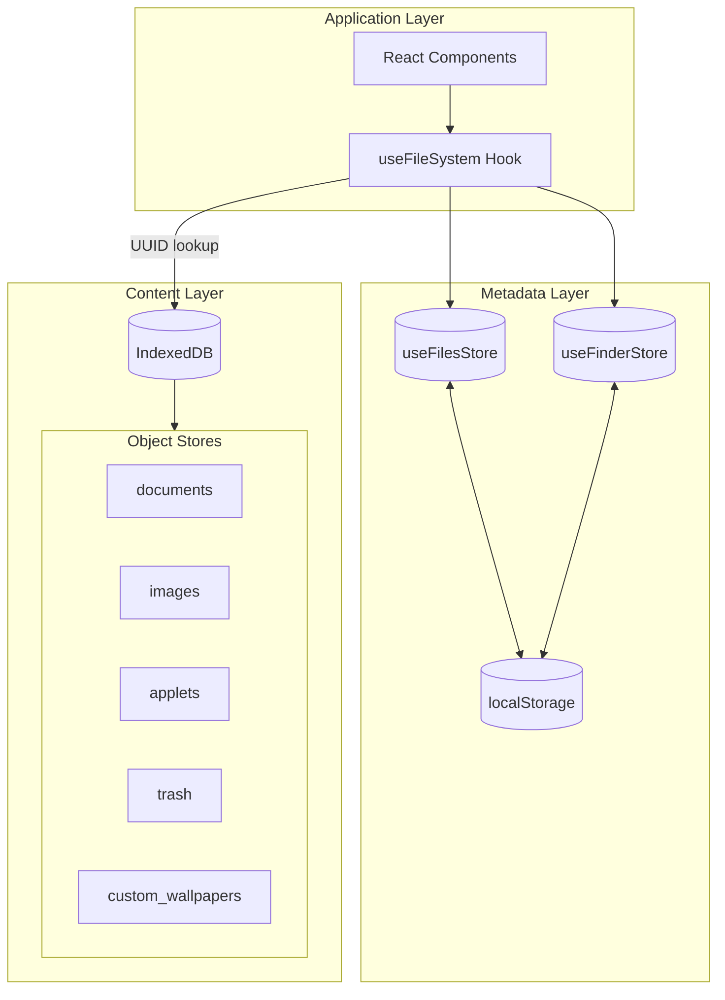
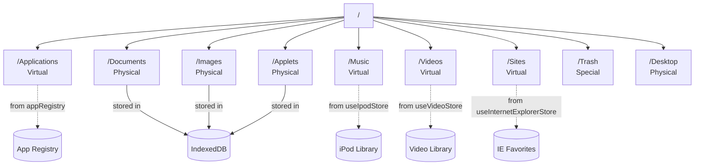

# File System

Browser-based hierarchical virtual file system with two-layer architecture for metadata and content separation.

## Two-Layer Architecture

- **Metadata Layer** (Zustand + localStorage): File paths, names, types, UUIDs, timestamps, and status
- **Content Layer** (IndexedDB): Actual file content indexed by UUID for efficient storage



## Key Stores

| Store | Purpose | Persistence |
|-------|---------|-------------|
| `useFilesStore` | File/folder metadata, paths, UUIDs, status | localStorage |
| `useFinderStore` | Finder window instances, navigation history, view preferences | localStorage |
| IndexedDB | File content (text, images, applets) | Browser storage |

## Directory Structure

| Path | Type | Description |
|------|------|-------------|
| `/` | Root | Root directory |
| `/Applications` | Virtual | Apps from registry (non-Finder apps) |
| `/Documents` | Physical | User text documents (.txt, .md) |
| `/Images` | Physical | User images (PNG, JPG, GIF, WebP, BMP) |
| `/Music` | Virtual | iPod library (organized by artist) |
| `/Videos` | Virtual | Video library (organized by artist) |
| `/Sites` | Virtual | Internet Explorer favorites |
| `/Applets` | Physical | HTML applets (.app, .html files) |
| `/Trash` | Special | Deleted items (restorable) |
| `/Desktop` | Physical | Shortcuts and aliases |



## File Metadata

```typescript
interface FileSystemItem {
  // Core properties
  path: string;           // Full path, unique identifier (e.g., "/Documents/note.md")
  name: string;           // File/folder name
  isDirectory: boolean;
  type?: string;          // File type (markdown, text, png, jpg, html, etc.)
  icon?: string;          // Icon path or emoji
  appId?: string;         // Associated application ID
  
  // Content reference
  uuid?: string;          // UUID for IndexedDB content lookup (files only)
  
  // File properties
  size?: number;          // File size in bytes
  createdAt?: number;     // Creation timestamp
  modifiedAt?: number;    // Last modified timestamp
  
  // Status
  status: "active" | "trashed";
  originalPath?: string;  // Path before moving to trash
  deletedAt?: number;     // When moved to trash
  
  // Applet sharing
  shareId?: string;       // Share ID for shared applets (from Redis)
  createdBy?: string;     // Creator username
  storeCreatedAt?: number;
  
  // Window dimensions
  windowWidth?: number;
  windowHeight?: number;
  
  // Alias/shortcut properties
  aliasTarget?: string;   // Target path or appId
  aliasType?: "file" | "app";
  hiddenOnThemes?: OsThemeId[];  // Hide on specific OS themes
}
```

## IndexedDB Storage

Database: `syaOS` (version 7)

| Object Store | Content Type | Key |
|--------------|--------------|-----|
| `documents` | Text files (strings) | UUID |
| `images` | Binary images (Blobs) | UUID |
| `applets` | HTML applet content | UUID |
| `trash` | Deleted file content | UUID |
| `custom_wallpapers` | User wallpapers | UUID |

Content structure stored in IndexedDB:
```typescript
interface StoredContent {
  name: string;               // Original filename
  content: string | Blob;     // File content
}
```

## CRUD Operations

### File Operations

```typescript
// useFileSystem hook provides these operations
const {
  // Navigation
  currentPath,
  navigateToPath,
  navigateUp,
  navigateBack,
  navigateForward,
  
  // File listing
  files,
  isLoading,
  error,
  
  // Selection
  selectedFile,
  handleFileSelect,
  handleFileOpen,
  
  // File operations
  saveFile,        // Create or update file
  renameFile,      // Rename file/folder
  createFolder,    // Create new folder
  moveFile,        // Move file to different folder
  
  // Trash operations
  moveToTrash,
  restoreFromTrash,
  emptyTrash,
  trashItemsCount,
  
  // System
  formatFileSystem,  // Reset entire filesystem
} = useFileSystem(initialPath, options);
```

### Save File Example
```typescript
await saveFile({
  path: "/Documents/note.md",
  name: "note.md",
  content: "# My Note\nContent here",
  type: "markdown",
  icon: "/icons/file-text.png",
});
```

### Move to Trash Flow
1. Mark item as `status: "trashed"` in metadata
2. Store `originalPath` and `deletedAt` timestamp
3. Move content from original store to `trash` store in IndexedDB
4. Update Trash folder icon (`trash-full.png`)

### Restore from Trash Flow
1. Reset `status` to `"active"`, clear `originalPath` and `deletedAt`
2. Move content back from `trash` store to original store
3. Update Trash folder icon if empty

## Lazy Loading

Default file content is lazy-loaded on first access:

```typescript
// Register files for lazy loading during initialization
registerFilesForLazyLoad(files, items);

// Load content when file is opened
await ensureFileContentLoaded(filePath, uuid);
```

Files with `assetPath` in `public/data/filesystem.json` are fetched on-demand, not during app initialization. This improves startup performance.

## Finder App Integration

### Multi-Window Support

Each Finder window is an instance with its own state:

```typescript
interface FinderInstance {
  instanceId: string;
  currentPath: string;
  navigationHistory: string[];
  navigationIndex: number;
  viewType: ViewType;        // "small" | "large" | "list"
  sortType: SortType;        // "name" | "date" | "size" | "kind"
  selectedFile: string | null;
}
```

### View Type Preferences

Per-path view type preferences persist across sessions:

```typescript
// Default view types by path
getDefaultViewTypeForPath(path) {
  if (path === "/" || path.startsWith("/Images") || 
      path.startsWith("/Applications") || path.startsWith("/Applets"))
    return "large";
  if (path.startsWith("/Documents") || path.startsWith("/Music"))
    return "list";
  return "list";
}
```

### File Type Detection

```typescript
function getFileTypeFromExtension(fileName: string): string {
  const ext = fileName.split(".").pop()?.toLowerCase();
  switch (ext) {
    case "md": return "markdown";
    case "txt": return "text";
    case "png": case "jpg": case "gif": case "webp": case "bmp": return ext;
    case "app": return "application";
    default: return "unknown";
  }
}
```

## Supported File Types

| Extension | Type | Opens With | Storage |
|-----------|------|------------|---------|
| `.md` | Markdown | TextEdit | IndexedDB (documents) |
| `.txt` | Plain text | TextEdit | IndexedDB (documents) |
| `.png`, `.jpg`, `.gif`, `.webp`, `.bmp` | Image | Paint | IndexedDB (images) |
| `.app`, `.html` | HTML Applet | Applet Viewer | IndexedDB (applets) |
| `.mp3` | Audio | iPod | Virtual (iPod store) |
| `.mov` | Video | Videos | Virtual (Video store) |
| `.webloc` | Web link | Internet Explorer | Virtual (IE store) |

## Desktop Shortcuts

Aliases/shortcuts on Desktop:

```typescript
// Create alias from context menu or drag
fileStore.createAlias(
  targetPath,      // Original file path or app ID
  aliasName,       // Display name
  aliasType,       // "file" | "app"
  targetAppId      // For app shortcuts
);
```

Desktop shortcuts support:
- App shortcuts (launches the app)
- File shortcuts (opens the target file)
- Theme-specific visibility (`hiddenOnThemes`)

## Migration System

Store version migrations handle schema changes:

```typescript
// Version history
// v5: Added UUID-based content keys
// v6: Added timestamps (createdAt, modifiedAt)
// v7: Added file size tracking
// v8: One-time sync for existing file sizes/timestamps
// v10: Updated Applets folder icon
```

## Events

File system changes emit custom events:

```typescript
// File saved/updated
window.dispatchEvent(new CustomEvent("fileUpdated", {
  detail: { name, path }
}));

// File renamed
window.dispatchEvent(new CustomEvent("fileRenamed", {
  detail: { oldPath, newPath, oldName, newName }
}));

// File saved (for applets)
window.dispatchEvent(new CustomEvent("saveFile", {
  detail: { name, path, content, icon }
}));
```
