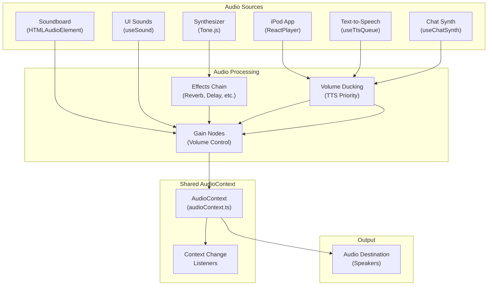
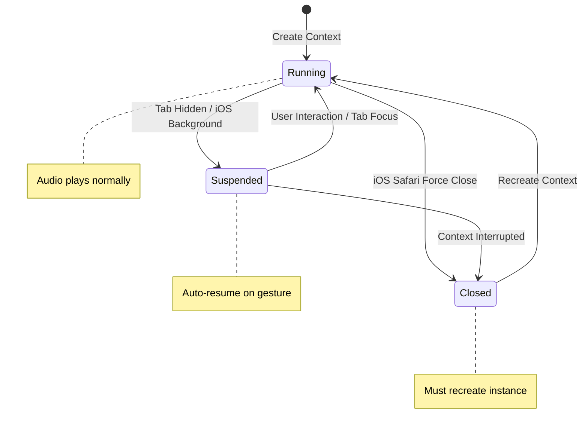
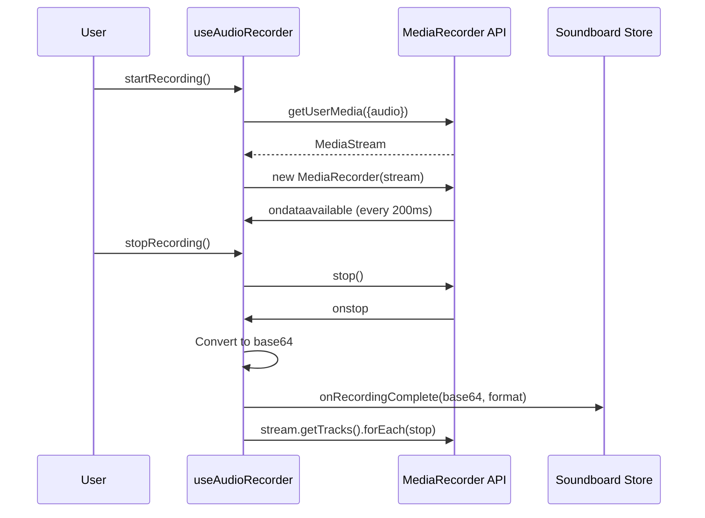

# Audio System

Overview of syaOS audio capabilities and architecture.

## Technologies

| Technology | Usage |
|------------|-------|
| Web Audio API | Core audio processing, centralized AudioContext management, UI sound playback, TTS audio scheduling |
| Tone.js | Synthesizer app with polyphonic synthesis, effects chain, and Chat typing synthesis |
| WaveSurfer.js | Waveform visualization for recorded sounds in Soundboard app |
| MediaRecorder API | Audio recording functionality for Soundboard app |
| ReactPlayer | YouTube video/audio playback in iPod app |

## Architecture Overview



## Audio Context Management

The audio system uses a centralized AudioContext (`src/lib/audioContext.ts`) with sophisticated lifecycle management:



### Key Features

- **Single Shared Instance**: One AudioContext shared across all audio modules
- **Lazy Initialization**: Context created on first use with `latencyHint: "interactive"`
- **Context Change Notifications**: Listener system (`onContextChange()`) allows modules to reset state when context is recreated
- **Concurrency Control**: Prevents race conditions during resume operations

### iOS Safari Handling

The audio context includes special handling for iOS Safari quirks:

```typescript
// Gesture events that unlock audio on iOS
const GESTURE_EVENTS = ["touchstart", "touchend", "click", "keydown"];

// Silent buffer technique for older iOS versions (iOS 6-8)
const buffer = ctx.createBuffer(1, 1, 22050);
const source = ctx.createBufferSource();
source.buffer = buffer;
source.connect(ctx.destination);
source.start(0);
source.stop(0);
```

### Auto-Resume Triggers

- `visibilitychange` event (tab becomes visible)
- `focus` event (window gains focus)
- `devicechange` event (Bluetooth/AirPlay device switching)
- User gesture events (touch, click, keydown)

## Audio Playback

syaOS provides multiple audio playback mechanisms:

### iPod App

Uses ReactPlayer for YouTube video/audio playback with:
- Volume control via `ipodVolume` setting
- Seeking and playback state management
- Fullscreen playback with synchronized lyrics display
- Volume ducking when TTS is speaking (35% of original on non-iOS)

### Soundboard App

Plays recorded audio clips using HTMLAudioElement:
- Supports multiple formats (WebM, MP4) with automatic browser detection
- Base64-encoded audio storage
- Waveform visualization using WaveSurfer.js (dynamically imported)
- Per-slot playback state tracking

### UI Sounds (`useSound`)

Web Audio API-based playback for interface feedback:

```typescript
// Performance tuning by device
const MAX_CONCURRENT_SOURCES = isMobileDevice ? 16 : 32;
const MAX_CACHE_SIZE = isMobileDevice ? 15 : 30;
```

**Features**:
- **AudioBuffer Caching**: LRU-style eviction when cache is full
- **Load Deduplication**: Prevents duplicate fetches for the same sound
- **Concurrent Source Limiting**: Skips playback when limit reached
- **Volume Control**: Master × UI volume multipliers with ramping
- **Fade In/Out**: Linear ramping to target volume
- **Auto-Resume**: Ensures AudioContext is running before playback
- **Context Change Detection**: Invalidates cache when context is recreated

**Available Sounds**:
- Window operations (open, close, expand, collapse, zoom, move, resize)
- UI interactions (button clicks, menu open/close)
- Alerts (sosumi, bonk, indigo)
- App-specific (photo shutter, video tape, boot, volume change, iPod click wheel)

**Lazy Preloading**: Sounds are preloaded after first user interaction:
- Mobile: Essential sounds only (button click, window open/close, menu open)
- Desktop: All sounds preloaded

## Synthesizer

The Synthesizer app (`src/apps/synth/`) provides a full-featured music synthesizer built with Tone.js:

### Audio Signal Chain

**Desktop (Full Effects)**:
```
Synth → Reverb → FeedbackDelay → Distortion → Chorus → Phaser → BitCrusher → Gain → Analyzer → Destination
```

**Mobile Safari (Simplified)**:
```
Synth → Gain → Analyzer → Destination
```

The simplified chain on mobile Safari prevents audio blocking issues that can occur with complex effects processing.

### Features

- **Oscillators**: Sine, square, triangle, and sawtooth waveforms
- **Polyphonic Synthesis**: `Tone.PolySynth` enables multiple simultaneous notes
- **ADSR Envelope**: Attack, decay, sustain, release controls
- **Effects Chain**:
  - Reverb (decay 2s, configurable wet mix)
  - Feedback Delay (0.25s delay time)
  - Distortion
  - Chorus (4Hz, 2.5ms delay, 0.7 depth)
  - Phaser (0.5Hz, 3 octaves)
  - BitCrusher (4-16 bit resolution)
  - Gain control
- **Preset System**: Save/load custom synthesizer configurations (persisted via Zustand)
- **Keyboard Support**: 
  - Virtual piano with touch/mouse/pointer support
  - Physical keyboard mapping (A-L, W-P for notes)
  - Octave shifting (±2 octaves via -/+ keys or buttons)
  - Glissando support via pointer move tracking
- **Visualization**: 3D waveform using `Tone.Analyser` (1024 samples, 0.8 smoothing)
- **Low Latency**: `Tone.context.lookAhead = 0` for immediate note triggering

## Chat Typing Synthesis (`useChatSynth`)

Provides musical feedback for typing in the Chat app:

### Features

- **Pentatonic Scale**: Notes C4, D4, F4, G4, A4, C5, D5 for pleasant sounds
- **Presets**: Classic, Ethereal, Digital, Retro, Off
- **Effects Chain**: Filter → Tremolo → Reverb → PolySynth
- **Voice Limiting**: 16 voices maximum
- **Global Instance**: Synth instance persists across HMR for seamless development
- **Volume Control**: Responds to `chatSynthVolume` and `masterVolume` settings

### Presets

| Preset | Oscillator | Character |
|--------|------------|-----------|
| Classic | Triangle | Warm, balanced |
| Ethereal | Sine | Soft, dreamy |
| Digital | Square | Sharp, electronic |
| Retro | Sawtooth | Vintage, buzzy |
| Off | - | Disabled |

## Text-to-Speech (`useTtsQueue`)

Provides gap-free TTS playback with intelligent queuing:

### Features

- **Gap-Free Playback**: Uses AudioContext timeline scheduling (`source.start(startTime)`)
- **Parallel Fetching**: Up to 3 concurrent TTS requests
- **TTS Providers**: OpenAI and ElevenLabs support
- **Volume Control**: Dedicated `speechVolume` with master multiplier
- **Micro-Fades**: 10ms fade-out before stopping to prevent clicks

### Volume Ducking

When TTS is speaking:
- iPod volume reduced to 35% (non-iOS only)
- Chat synth volume reduced to 60%
- Original volumes restored when speech ends

```typescript
// Ducking example
if (isSpeaking && ipodIsPlaying && !isIOS) {
  const duckedIpod = originalVolume * 0.35;
  setIpodVolumeGlobal(duckedIpod);
}
```

## Sound Recording

The Soundboard app provides audio recording via the `useAudioRecorder` hook:

### Features

- **MediaRecorder API**: Records from user's microphone
- **Format Detection**: WebM for Chrome/Firefox, MP4 for Safari
- **Device Selection**: Supports specific audio input device selection
- **Chunk-Based Recording**: 200ms intervals for streaming data
- **Base64 Storage**: Recorded audio converted for persistence
- **Stream Cleanup**: Properly stops all media tracks after recording

### Recording Flow



## Audio Settings

Audio settings are managed via `useAudioSettingsStore` (Zustand with persistence):

### Volume Controls

| Setting | Default | Description |
|---------|---------|-------------|
| `masterVolume` | 1.0 | Global volume multiplier |
| `uiVolume` | 1.0 | Interface sounds volume |
| `chatSynthVolume` | 2.0 | Chat typing synthesis volume |
| `speechVolume` | 2.0 | TTS voice volume |
| `ipodVolume` | 1.0 | Music player volume |

### Feature Toggles

| Setting | Default | Description |
|---------|---------|-------------|
| `uiSoundsEnabled` | true | Enable/disable UI sounds |
| `terminalSoundsEnabled` | true | Enable/disable terminal sounds |
| `typingSynthEnabled` | false | Enable/disable chat typing synthesis |
| `speechEnabled` | false | Enable/disable voice input/output |
| `keepTalkingEnabled` | true | Continue listening after speech |

### TTS Settings

| Setting | Default | Description |
|---------|---------|-------------|
| `ttsModel` | null | TTS provider (openai, elevenlabs, null) |
| `ttsVoice` | null | Voice ID for selected provider |
| `synthPreset` | "classic" | Chat synth preset name |

### Persistence

All settings are persisted to localStorage via Zustand's persist middleware:
- Storage key: `ryos:audio-settings`
- Version: 1 (for migration support)

### Convenience Selectors

```typescript
export const selectMasterVolume = (state) => state.masterVolume;
export const selectUiVolume = (state) => state.uiVolume;
export const selectUiSoundsEnabled = (state) => state.uiSoundsEnabled;
```

## Audio Utilities

Helper functions in `src/utils/audio.ts`:

### `createWaveform(container, base64Data, format?)`
Creates a WaveSurfer instance for waveform visualization. Ensures shared AudioContext is ready first to avoid Safari's context limit issues.

### `createAudioFromBase64(base64Data, format?)`
Creates an HTMLAudioElement from base64-encoded audio data.

### `getSupportedMimeType()`
Returns the appropriate MIME type for the current browser:
- Safari: `audio/mp4`
- Others: `audio/webm`

### `base64FromBlob(blob)` / `bufferToBase64(buffer)`
Converts Blob/ArrayBuffer to base64 string for storage.
