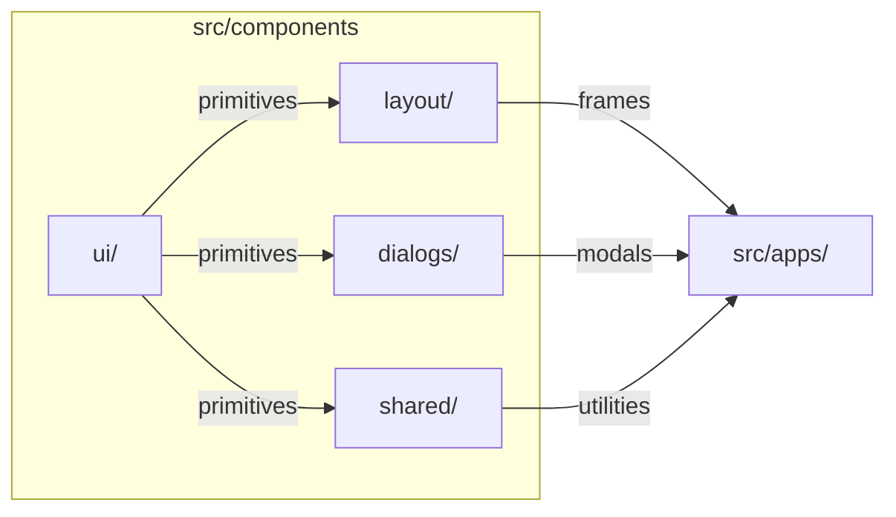
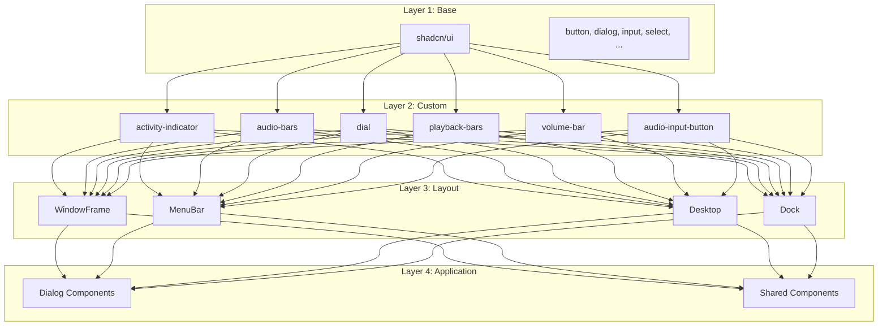

# UI Components and Shared Systems

Overview of shared UI components and system-wide utilities that power the syaOS desktop environment.

## Overview

The syaOS component architecture is organized into distinct categories, each serving specific purposes across the desktop environment. Components are built with React and TypeScript, leveraging Tailwind CSS for styling and shadcn/ui as the foundation for consistent, accessible UI elements. The system emphasizes reusability, theme-aware components, and cross-app compatibility.

The component library is structured hierarchically: base UI components provide fundamental building blocks, layout components handle window management and desktop structure, dialog components manage modal interactions, and shared components offer cross-application utilities. This organization ensures consistent behavior and appearance across all 17 built-in applications while maintaining flexibility for app-specific customizations.

## Component Categories

| Category | Description | Location |
|----------|-------------|----------|
| UI Components | shadcn-based components and custom primitives | `src/components/ui/` |
| Layout Components | Window frames, desktop layout, menu bars | `src/components/layout/` |
| Dialog Components | Modal dialogs, alerts, and system dialogs | `src/components/dialogs/` |
| Shared Components | Cross-app utilities and themed components | `src/components/shared/` |

## Technologies

- **React 19** with TypeScript for type-safe component development
- **Tailwind CSS** for utility-first styling and theme support
- **shadcn/ui** component library for accessible, customizable UI primitives
- **Framer Motion** for animations and transitions

## Component Architecture

The UI system follows a layered approach:

1. **Base Layer**: shadcn/ui components (19 components: button, dialog, input, select, etc.) provide accessible, themeable primitives
2. **Custom Layer**: Specialized components (10 components: activity-indicator, audio-bars, dial, playback-bars, etc.) extend functionality for app-specific needs
3. **Layout Layer**: WindowFrame, MenuBar, Desktop, and Dock components manage the desktop environment structure
4. **Application Layer**: Dialog and shared components (10 components) provide common patterns used across multiple apps

All components are theme-aware, automatically adapting to the active system theme (System 7, Mac OS X, Windows XP, Windows 98) through the theme system.

## Subsections

- [Component Library](/docs/component-library) - Core UI component library including 19 shadcn components, 10 custom primitives, and 10 shared components
- [Internationalization](/docs/i18n) - i18n hooks and translation system supporting 10 languages
