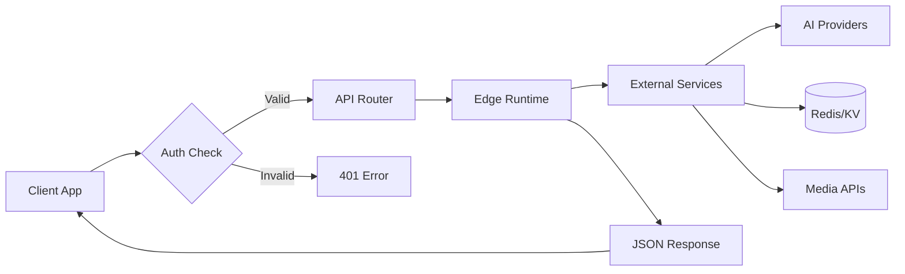
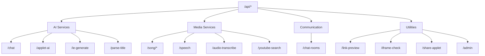

# API Reference

syaOS uses Vercel Serverless Functions with Edge runtime for all backend APIs.

## API Request Flow



## Endpoint Documentation

| Endpoint Group | Description |
|----------------|-------------|
| [Chat API](/docs/chat-api) | Main AI chat with streaming and tool calling |
| [Song API](/docs/song-api) | Music library CRUD, lyrics, furigana, translations |
| [Media API](/docs/media-api) | Text-to-speech, transcription, YouTube search |
| [Chat Rooms API](/docs/chat-rooms-api) | Real-time chat rooms with Pusher/Redis |
| [AI Generation APIs](/docs/ai-generation-apis) | Applet generation, IE time-travel, parse-title |
| [Utility APIs](/docs/utility-apis) | Link preview, iframe check, share applet, admin |

## Quick Reference

### AI Endpoints

| Endpoint | Purpose |
|----------|---------|
| `/api/chat` | Main AI chat with tool calling |
| `/api/applet-ai` | Applet text + image generation |
| `/api/ie-generate` | Time-travel page generation |
| `/api/parse-title` | Music metadata extraction |

### Media Endpoints

| Endpoint | Purpose |
|----------|---------|
| `/api/song/` | Song library CRUD |
| `/api/song/[id]` | Individual song operations |
| `/api/speech` | Text-to-speech |
| `/api/audio-transcribe` | Speech-to-text |
| `/api/youtube-search` | YouTube music search |

### Communication Endpoints

| Endpoint | Purpose |
|----------|---------|
| `/api/chat-rooms` | Real-time chat room management |

### Utility Endpoints

| Endpoint | Purpose |
|----------|---------|
| `/api/link-preview` | URL metadata extraction |
| `/api/iframe-check` | Embeddability checking |
| `/api/share-applet` | Applet sharing |
| `/api/admin` | Admin operations |

### Endpoint Categories Overview



## Authentication

```
Authorization: Bearer {token}
X-Username: {username}
```

Token-based with 90-day expiration.

## AI Providers

| Provider | Models |
|----------|--------|
| OpenAI | gpt-5, gpt-5.1, gpt-5-mini, gpt-4o, gpt-4.1, gpt-4.1-mini |
| Anthropic | claude-4.5, claude-4, claude-3.7, claude-3.5 |
| Google | gemini-2.5-pro, gemini-2.5-flash, gemini-3-pro-preview |
